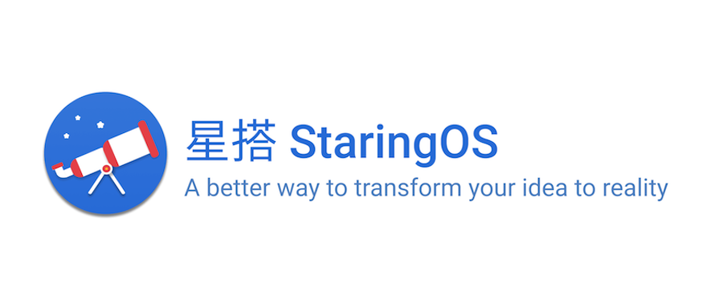
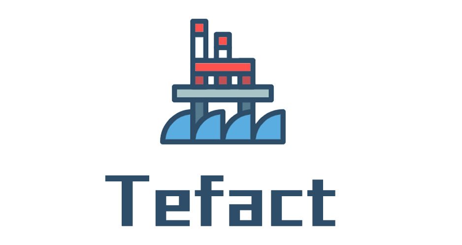

# 目录

收集整理我的学习笔记、各类图书的读后感、每天的思考及脑洞。涉及电影、历史、政治、技术、架构、运营、市场等各个方面，[https://blog.tefact.com](https://blog.tefact.com)

<table align="center">
  <thead>
    <tr>
      <th style="text-align:left">&#x516C;&#x4F17;&#x53F7;</th>
      <th style="text-align:left">GitBook</th>
      <th style="text-align:left">Github</th>
    </tr>
  </thead>
  <tbody>
    <tr>
      <td style="text-align:left">
        
      </td>
      <td style="text-align:left">
        
<a href="https://blog.tefact.com">@&#x8DF3;&#x52A8;&#x7684;&#x795E;&#x7ECF;&#x5143;</a> 
        

        
<a href="https://interview.tefact.com/">@&#x5927;&#x5382;&#x6DF1;&#x5EA6;&#x524D;&#x7AEF;&#x9762;&#x8BD5;&#x9898;</a>
        

      </td>
      <td style="text-align:left"><a href="https://github.com/georgezouq/blog">@&#x8DF3;&#x52A8;&#x7684;&#x795E;&#x7ECF;&#x5143;</a>
      </td>
    </tr>
  </tbody>
</table>

## 我的产品

<table style="width: 100%;" align="center">
    <tbody>
        <tr>
<!--             <td style="text-align:center" align="center">
                
            </td> -->
            <td style="text-align:center" align="center">
                
            </td>
            <!-- <td style="text-align:center" align="center">
                
            </td> -->
            <td style="text-align:center" align="center">
                
            </td>
            <td style="text-align:center" align="center">
                
            </td>
        </tr>
    </tbody>
</table>

## 文章推荐

#### [大数据场景下图表组件的设计与思考](ji-shu-wen-zhang/da-shu-ju-chang-jing-xia-tu-biao-zu-jian-de-she-ji-yu-si-kao.md)

渐进式图表、事件机制、局部渲染，本文总结了主流图表组件在大数据量、强交互场景下打造高性能图表的设计与优化方法。

#### [从BI项⽬实践思考软件复杂度控制的常⻅⽅法](https://github.com/georgezouq/blog/tree/e735e5140d2f9df05e543376fcf388e8b14fdda6/技术文章/从BI项目实践思考软件复杂度控制的常见方法.pdf)

在我看来，软件工程所要解决的首要问题在于如何以一种合理的方式将项目、业务的复杂性控制到一个可维护、可迭代的范围内。这也是为什么，我们一直再讲 分层、高内聚、低耦合、单一职能...但是如何将这些概念运用在实际项目中...

#### [How people use AI in finance](https://github.com/georgezouq/awesome-ai-in-finance)

There are millions of trade made in the global financial market every day. Data grow very quickly and people are hard to understand. With the power of the latest artificial intelligence research, people analyze & trade automatically and intelligently...

#### [光荣与梦想 美国社会的成长与彷徨](shu-ping-ying-ping/guang-rong-yu-meng-xiang.md)

从节俭到消费；从农村到城市；从市区到郊区；从市中心的商场到郊区的工厂店；从迎合到叛逆；从保守到开放。这是美国战后随着经济发展一路的变化，对比我们有太多的相似之处...

## 目录

### 技术分享 PPT

* [一段数据的可视化之旅 - PowerChart预发布 \(2020\)](/技术文章/一段数据的可视化之旅-PowerChart预发布.pdf)
* [从BI项⽬实践思考软件复杂度控制的常⻅⽅法 \(2020\)](https://github.com/georgezouq/blog/tree/e735e5140d2f9df05e543376fcf388e8b14fdda6/技术文章/从BI项目实践思考软件复杂度控制的常见方法.pdf)
* [机器学习入门 之 股票价格时序数据分析 \(2017\)](https://slides.com/georgezou/title-text)
* [自动化测试 之 单元测试 \(2017\)](https://slides.com/georgezou/unit-test)
* [IM ARCHITECTURE OPTIMIZATION \(2017\)](https://slides.com/georgezou/deck)
* [Why Redux and How \(2016\)](https://slides.com/georgezou/why-redux)

### 技术文章

* [关于星搭：你心所想，即是应用](https://staringos.com/docs/about) 2021-03
* [致敬计算机先驱](ji-shu-wen-zhang/zhi-jing-ji-suan-ji-xian-qu.md)
* [大数据场景下图表组件的设计与思考](ji-shu-wen-zhang/da-shu-ju-chang-jing-xia-tu-biao-zu-jian-de-she-ji-yu-si-kao.md)
* [Vue 编码规范](ji-shu-wen-zhang/vue-bian-ma-gui-fan.md)
* [工作流\(Workflow\) 与 流程\(Process\)的区别与联系](https://juejin.im/post/5efe7bab6fb9a07e9608bf8e)
* [Vue3.0 性能优化及新特性深度解析](https://juejin.im/post/5ef576605188252e5c575645)
* [我的轻敏捷技术管理方法论](ji-shu-wen-zhang/wo-de-qing-min-jie-ji-shu-guan-li-fang-fa-lun.md)
* [超大型高并发系统架构的阿里经验](ji-shu-wen-zhang/chao-da-xing-gao-bing-fa-xi-tong-jia-gou-deali-jing-yan.md)
* [大厂深度前端面试题](https://interview.tefact.com/)
* [企业级业务架构设计](shu-ping-ying-ping/qi-ye-ji-ye-wu-jia-gou.md)
* [软件工程奇淫巧技及优秀文章收藏夹](ji-shu-wen-zhang/ruan-jian-gong-cheng-qi-yin-qiao-ji-ji-you-xiu-wen-zhang-shou-cang-jia.md)
* [JS数据结构与算法题解笔记集](ji-shu-wen-zhang/js-shu-ju-jie-gou-yu-suan-fa-ti-jie-bi-ji-ji.md)
* [2013年的一段演讲：思考React最佳实践](ji-shu-wen-zhang/si-kao-react-zui-jia-shi-jian.md)
* [从 NPM 数据看前端发展趋势](ji-shu-wen-zhang/cong-npm-shu-ju-kan-qian-duan-de-fa-zhan-qu-shi.md)
* [锐途云架构设计参考资料集](ji-shu-wen-zhang/rui-tu-yun-jia-gou-she-ji-can-kao-zi-liao-ji.md)
* [IM客户端设计常见问题](ji-shu-wen-zhang/im-ke-hu-duan-she-ji-chang-jian-wen-ti.md)
* [技术驱动业务增长的几个方法](ji-shu-wen-zhang/ji-shu-qu-dong-ye-wu-zeng-chang-de-ji-ge-fang-fa.md)

### 金融

* [驾驭市场的随机性 —— 寻找确定性漩涡](jin-rong-liang-hua/hun-dun-li-lun-yu-jin-rong-shi-chang-xun-zhao-que-ding-xing-xuan-wo.md)
* [How people use AI in finance](https://github.com/georgezouq/awesome-ai-in-finance)
* [量化日记: 数字货币的共识与不确定性](jin-rong-liang-hua/liang-hua-ri-ji-20180814.md)
* [量化日记：指标实践及理解](jin-rong-liang-hua/liang-hua-ri-ji-20180811.md)
* [量化日记：策略的坚持与变通](jin-rong-liang-hua/liang-hua-ri-ji-20180802.md)

### 书评

* [保持内心的平静 —— 读高瓴张磊新书《价值》](shu-ping-ying-ping/jia-zhi.md)
* [从管仲变法到国企改革:《历代经济变革得失》](shu-ping-ying-ping/cong-guan-zhong-bian-fa-dao-guo-qi-gai-ge-li-dai-jing-ji-bian-ge-de-shi.md)
* [《光荣与梦想》美国社会的成长与彷徨](shu-ping-ying-ping/guang-rong-yu-meng-xiang.md)
* [从《叫魂案》与《万历十五年》窥探传统中国社会矛盾](za-wen/mingqing.md)
* [《阿里局》 书评及摘抄](shu-ping-ying-ping/a-li-ju.md)
* [王沪宁《政治人生》读感](shu-ping-ying-ping/politicallife.md)
* [《百年孤独》书评及摘抄](shu-ping-ying-ping/cienanosdesoledad.md)
* [《三大思考工具轻松解决问题》学习笔记](shu-ping-ying-ping/san-da-si-kao-gong-ju-qing-song-jie-jue-wen-ti.md)
* [《君主论》摘抄](shu-ping-ying-ping/jun-zhu-lun.md)

### 杂文

* [记与一个孩子的有趣对话](https://mp.weixin.qq.com/s?__biz=MzUzNzQwNjI1Ng==&mid=2247483787&idx=1&sn=5e9b2826a6e5bd5ead270e30896570dd&chksm=fae63fd4cd91b6c283b9c1a56bb21e7d0e99406e5275becb70e245e5e3710dde283b167efd6c&token=1173882900&lang=zh_CN#rd) 2021.4
* [十一房车游记](https://mp.weixin.qq.com/s?__biz=MzUzNzQwNjI1Ng==&mid=2247483752&idx=1&sn=116a59b687b270c7e6b8e9de45b24946&chksm=fae63f37cd91b6214330da6ad3b2e48b87958e99f231734f476fa9088a9cfecff6ba1106e2bf&token=1658332771&lang=zh_CN#rd) 2020.10
* [马男波杰克](shu-ping-ying-ping/ma-nan-bo-jie-ke.md)
* [事物背后的逻辑](za-wen/shi-wu-bei-hou-de-luo-ji.md)
* [从文化角度思考美国底层的悲歌](za-wen/cong-wen-hua-jiao-du-si-kao-mei-guo-di-ceng-de-bei-ge.md)
* [文学的悲喜](za-wen/wen-xue-de-bei-xi.md)

### 其他

* [书单](shu-dan.md)
* [歌单](qi-ta/songlist.md)
* [入世集 - 当代社会研究书单](shu-ping-ying-ping/ru-shi-ji.md)
* [商业智能产品研究（1）—— 重新思考商业智能定义](./)
* [高效工作/学习的小技巧](za-wen/gao-xiao-neng-de-xiao-ji-qiao.md)
* [文字的力量 - 书、文章、电影、诗词摘抄](qi-ta/thepowerofwords.md)
* [《肖申克的救赎》观后感](shu-ping-ying-ping/xiao-shen-ke-de-jiu-shu.md)
* [有意思的云服务收藏夹](qi-ta/cloudservices.md)
