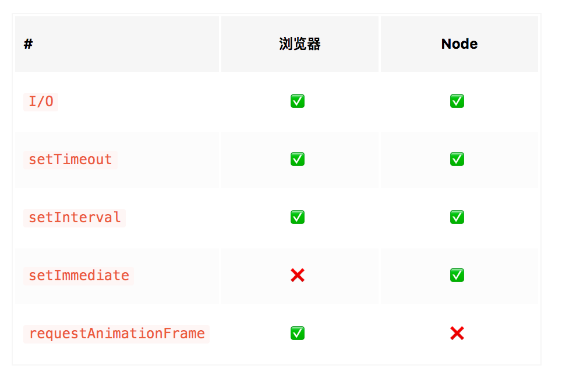
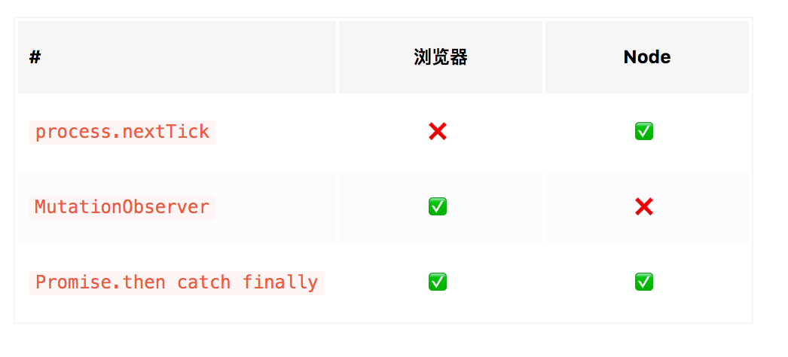

# 宏任务、微任务及 EventLoop


```js
function async1() {
  console.log('async1 start'); 

  Promise.resolve(async2()).then(() => {
    console.log('async1 end'); 
  });
}

function async2() {
  console.log('async2'); 
}

console.log('script start'); 

setTimeout(function() {
  console.log('settimeout');
}, 0);

async1();

new Promise(function(resolve) {
  console.log('promise1')
  resolve();
}).then(function() {
  console.log('promise2');
});
console.log('script end');
```

执行顺序

- script start
- async1 start
- async2
- promise1
- script end
- async1 end
- promise2
- settimeout

### JavaScript 的内存机制

JavaScript分为两种形式：堆内存 和 栈内存

- 因为Javascript 引用类型、对象大小不确定，所有js将他们存储在堆中，因为js规定堆是不能自由操作的，所有我们一般是拿到对象的地址访问对象
- JS中的基本类型都是固定大小，所以与对象引用（指针）、函数执行时的运行空间一起存储在栈中，栈内存可以按值访问

### 执行栈

当我们调用一个方法的时候，JS 会创建与这个方法对应的执行环境，称为执行栈（执行上下文）。其中有这个方法的 私有作用域、上层作用域（作用域链）、方法的参数，以及这个作用域中定义的变量和this的指向。

### 任务队列

任务对象存储着 异步任务 的队列，其中的任务严格按照时间先后顺序执行，排在对头的任务将会率先执行，队尾的任务最后执行。任务队列每次仅执行一个任务，在该任务执行完之后，在执行下一个任务。执行栈则是一个类似函数调用栈的运行容器，当执行栈为空时，JS引擎检查任务队列，如果任务队列不为空的话，任务队列便将第一个任务押入执行栈中运行。


### 宏任务



### 微任务



异步任务分为 宏任务(macrotask) 与 微任务 (microtask)。宏任务会进入一个队列，而微任务会进入到另一个不同的队列，且微任务要优于宏任务执行。

### Async / Await

async/await 仅仅是生成器的语法糖，所以只要把它转换成 Promise 的形式即可。下面这段代码是 async/await 函数的经典形式。

### Node 与 浏览器环境下 事件循环的区别

Node 增加 setImmediate 

Node中的 EventLoop 和浏览器中的是完全不同的东西。Node 使用 V8作为解析引擎，而IO方面使用了自己设计的 libuv，libuv 是一个基于事件驱动的跨平台抽象层，封装了不同操作系统的一些底层特性，对外提供统一API，事件循环机制也是它里面实现的。


- V8 解析 JS 脚本
- 解析后代码，调用 NodeAPI
- libuv 库负责 NodeAPI 的执行，他将不同的任务分配给不同的线程，形成一个 EventLoop，以异步的方式将任务的执行结果返回给 V8 引擎，V8在将结果返回给用户。

#### 六个阶段


其中 libuv 引擎重的事件循环分为6个阶段，他们会按照顺序反复运行。每当进入某一阶段的时候，都会从对应的回调队列中取出函数去执行。当队列为空或者执行的回调函数数量达到系统阈值，就会进入下一个阶段。

- timers 阶段：这个阶段执行timer（setTimeout、setInterval）的回调，Node 中定时器执行的事件也不是准确时间
- I/O callbacks 阶段：处理一些上一轮循环中的少数未执行的 I/O 回调
- idle, prepare 阶段：仅node内部使用
- poll 阶段：获取新的I/O事件, 适当的条件下node将阻塞在这里
    - 回到 timer 阶段执行回调
    - 执行 I/O 回调
- check 阶段：执行 setImmediate() 的回调
- close callbacks 阶段：执行 socket 的 close 事件回调

##### 浏览器EventLoop


##### Node EventLoop


### 参考资料

- 浏览器：[最后一次搞懂 Event Loop](https://juejin.im/post/5cbc0a9cf265da03b11f3505)
- Node: [浏览器与Node的事件循环(Event Loop)有何区别?](https://juejin.im/post/5c337ae06fb9a049bc4cd218)
