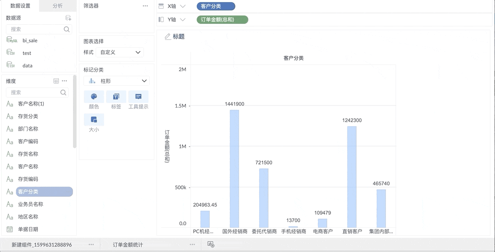
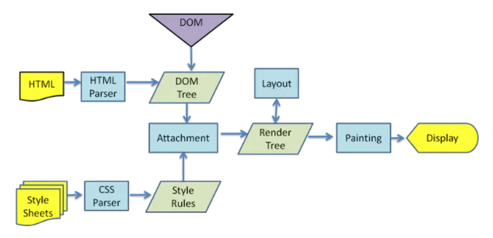
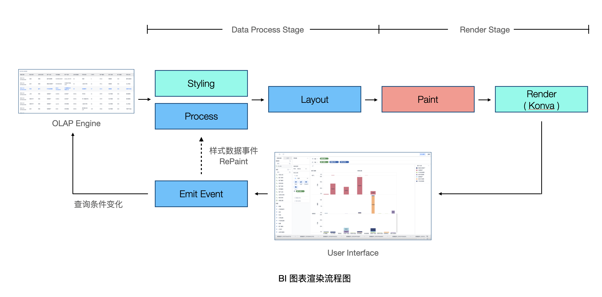
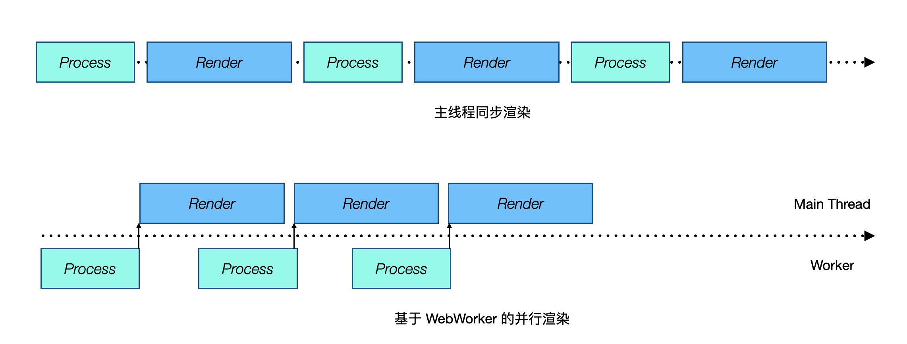
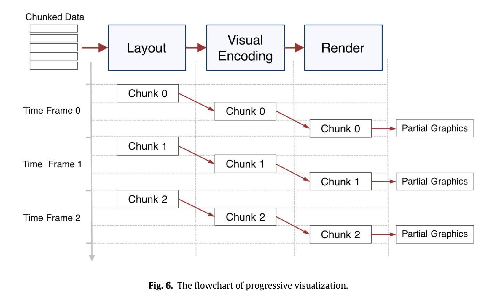
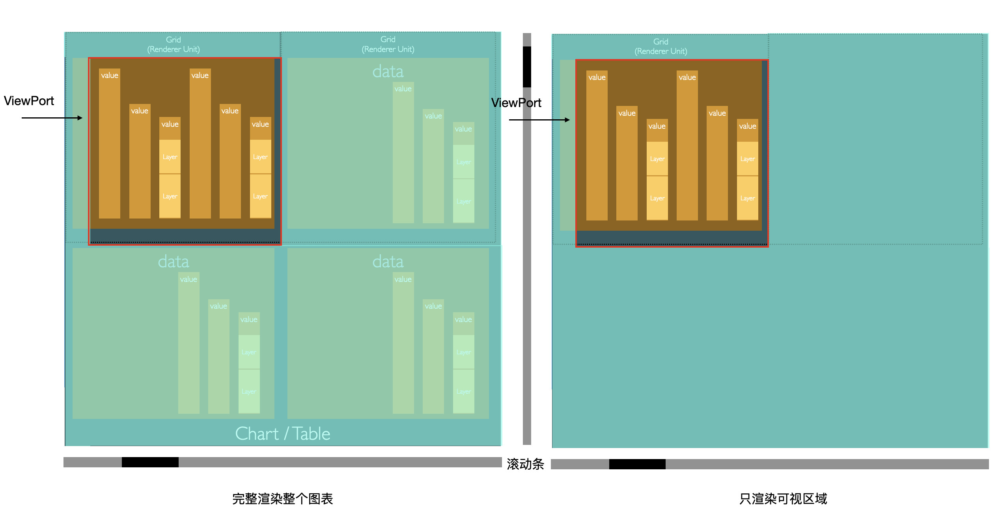

# 大数据场景下图表组件的设计与优化

随着信息技术的发展，各种业务场景下数据量、数据维度极速增长，对于如何发觉数据的价值，找出数据之间关联的需求不断增加。BI（商业智能）平台通过拖拽，以可视化的方式将一个多维度展示需求通过转换合并，以表格的行或列的形式呈现。并将组合后的第一个维度作为图表轴，根据用户配置生成柱状、散点等图表。

![&#x6839;&#x636E;&#x53EF;&#x89C6;&#x5316;&#x9700;&#x6C42;&#x751F;&#x6210;&#x6570;&#x636E;&#x5E93;&#x67E5;&#x8BE2;&#xFF0C;&#x9009;&#x62E9;&#x6240;&#x9700;&#x5B50;&#x96C6;&#xFF0C;&#x7ECF;&#x8FC7; &#x805A;&#x5408;&#x3001;&#x8FC7;&#x6EE4;&#x3001;&#x6392;&#x5E8F;&#x3001;&#x8868;&#x8BA1;&#x7B97;&#x540E;&#xFF0C;&#x63D0;&#x4F9B;&#x7ED9;&#x9875;&#x9762;&#x5C55;&#x73B0;\[1\]](../.gitbook/assets/8.png)

在我们的BI产品研发过程中，图表组件为其中重要的一环，需要考虑前端组件在大数据量、强交互的场景下，组合图表矩阵实现实时渲染。



基于此需求，我们必须适配以下业务场景：

* 复杂的功能交互
* 大数据量
* 动态配置的样式及展示效果
* 较高的渲染性能要求

为此我们基于 [Konva](https://github.com/konvajs/konva) 实现一套图表组件，参考 G/G2.JS、ZRender/Echarts、Charts.JS 等图表及 Canvas 渲染框架的设计。比较研究了这些领先的图表组件中一些有意思的设计及优化方法，结合我们自身实践经验，在下面与大家分享。

## 模拟浏览器渲染

首先我们来复习一下浏览器渲染流程，浏览器首先会获取、解析 HTML 文件生成 DOM Tree，其后解析 CSS 文件，生成 CSSOM Tree。在经过 Compose 阶段，将 DOM 和 CSSOM 合并成 RenderTree。最后 RenderTree 经过 回流（绘制骨架）及 重汇（渲染样式）完成这整个页面的渲染。



我们的图表组件渲染过程也模拟了浏览器渲染，首先后端会将经过基础计算的原始数据返回过来，我们对基础数据结构进行遍历及业务处理，生成整个图表的骨架，类似 DOM Tree 结构。而后我们会根据对图表不同部分的样式的配置，生成每个部分的样式数据，相当于 CSS Tree。其后，会经过一系列数据处理管道将 `样式` 和 `图表基础数据` 合并成预渲染数据 `renderData`。



## 实现数据处理与渲染的并行

图表渲染主要分为两个阶段：Data Process & Render。Process 部分包括上文提到的对图表样式、基础数据及业务逻辑处理。Render 部分调用 Konva 和 Canvas 原生 API 进行渲染。在一开始渲染及重绘的过程是同步进行的。这样的绘制过程有大量的时间浪费（下次渲染需要等待数据处理），我们参考了 [ECharts 对渲染过程的处理](https://lavrton.com/hit-region-detection-for-html5-canvas-and-how-to-listen-to-click-events-on-canvas-shapes-815034d7e9f8) ，通过 `WebWorker` 实现计算和渲染过程并行处理，进一步优化图表响应速度：



## 事件机制优化

在开发图表框架的时候，对事件的处理是不可忽视的一环。由于在 Canvas 中绘制一个元素相当于使用 \[Immutable 模式\]\([https://en.wikipedia.org/wiki/Immediate\_mode\_\(computer\_graphics](https://en.wikipedia.org/wiki/Immediate_mode_%28computer_graphics)\)\) 绘制一个 Bitmap —— 元素全部变成像素，没有元素的概念了。既然没有原生的事件响应，常见的 Canvas 库中一般有两种元素事件的实现方式：

* 基于数学计算
* 基于元素颜色

### 基于数学计算

给出每一个元素的计算方法，基于对元素形状的数学计算，根据点击位置找到对应元素。例如在 [Lavrton 的文章中](https://lavrton.com/hit-region-detection-for-html5-canvas-and-how-to-listen-to-click-events-on-canvas-shapes-815034d7e9f8/) 识别一个圆形的例子：

```javascript
function isIntersect(point, circle) {
  return Math.sqrt((point.x-circle.x) ** 2 + (point.y - circle.y) ** 2) < circle.radius;
}

canvas.addEventListener('click', (e) => {
  const pos = {
    x: e.clientX,
    y: e.clientY
  };
  circles.forEach(circle => {
    if (isIntersect(mousePoint, circle)) {
      alert('click on circle: ' + circle.id);
    }
  });
});
```

### 基于颜色

我们可以从点击事件中获取点击位置像素的颜色，通过像素颜色可以找到对应元素，但如果有两个元素颜色一样怎么办？Konva 中通过增加了一层 `HitCanvas`，将正常的 `SceneCanvas` 上的元素按照原有位置摆放好，但是给每一个元素都设置了不同的颜色。点击的时候，通过点击事件获取到对应颜色，即可找到对应元素。

### 两种方式的比较

两种对事件处理的实现各有各的优缺点，在阿里的 [G.js](https://github.com/antvis/g) \(G2、G6 的底层渲染框架\) 是通过数学计算的方式实现。这种基于数学计算的模式对于元素的[拾取效率比较高](https://www.yuque.com/antv/ou292n/okxrus)\[8\] 。但实现起来相对复杂，需要适配每一种图形，针对复杂模型，计算效率也不会很高。

在 Konva 等框架中则是通过第二种方式，通过识别颜色，增加一层 `HitCanvas` 实现事件机制。这种模式的优点在于实现、理解起来简单，但效率较数学计算低，因为增加了一次渲染。这也是为什么 Konva 在官方文档的 [优化方案](https://konvajs.org/docs/performance/Listening_False.html) 中提到，对于不需要事件响应的元素可以通过 `listening(false)` 不将其加入 `HitCanvas` 以提高渲染效率。

## 渐进式图表

对于渐进式图表的渲染，我们可以先回忆一下 [React Fiber](https://indepth.dev/the-how-and-why-on-reacts-usage-of-linked-list-in-fiber-to-walk-the-components-tree/) 中对渲染流程的优化：

React Fiber 将一次大的渲染任务拆分为一系列小的渲染任务，每一个任务可以在浏览器的一帧（16ms）中执行完毕，并将任务分为高优先级（用户事件等）和 低优先级任务（普通渲染任务）分别处理。


在针对 Canvas 的图表中，我们也可以实现类似的机制以提高渲染性能，将一次大的图表渲染按照渲染元素的数量拆分为多个任务，要解决的问题与 React Fiber 一致：

* 分拆任务以保证每个任务能在1帧内执行完
* 防止对主进程占用太长时间影响页面动画、交互
* 可以动态对任务进行调整，暂停、删除、终止任务
* 对不同类型的任务区分高低优先级

在 `G.js（分片渲染）` 和 `ECharts（渐进式图表）` 中都实现类似的渲染机制分拆大数据量下的渲染任务，在 G.js 中对数据的分拆 与 局部渲染结合到了一起:

```javascript
  _startDraw() {
    let drawFrame = this.get('drawFrame');
    if (!drawFrame) {
      drawFrame = requestAnimationFrame(() => {
        if (this.get('localRefresh')) {
          this._drawRegion();
        } else {
          this._drawAll();
        }
        this.set('drawFrame', null);
      });
      this.set('drawFrame', drawFrame);
    }
  }
```

在 Echarts 中将大型任务拆分成一个个chunk，持续渲染以避免卡顿：



## 局部渲染

上文有提到 Canvas 是基于 Bitmap 的，其中没有元素概念，只有绘制上去的一个个像素点。即不能响应单个元素事件，也不能针对单个元素做删除和修改。但如果一次简单改动的就需要对整个画布进行重绘，性能开销巨大。在 [G.js 对局部渲染的处理](https://www.yuque.com/antv/ou292n/pcgt5g) 中，通过一些 Canvas 局部处理的 API，我们可以实现在某一区域内进行擦除和重新绘制。

* `ctx.clearRect(x, y, width, height)` 擦除区域内的像素点
* `ctx.fillRect(x, y, width, height)` 对执行区域进行绘制

G.js 局部渲染的实现：

```javascript
// 清理指定区域
context.clearRect(region.minX, region.minY, region.maxX - region.minX, region.maxY - region.minY);
// 保存上下文，设置 clip
context.save();
context.beginPath();
context.rect(region.minX, region.minY, region.maxX - region.minX, region.maxY - region.minY);
context.clip();
applyAttrsToContext(context, this);
// 确认更新的元素，这个优化可以提升 10 倍左右的性能，10W 个带有 group 的节点，局部渲染会从 90ms 下降到 5-6 ms
checkRefresh(this, children, region);
// 绘制子元素
drawChildren(context, children, region);
context.restore();
```

## 渲染可视区域

对于大型图表，有很大一部分元素是在滚动条之外不可见的，如果我们一口气把全部图表都渲染出来，消耗大量性能的同时做了很多无用的工作，所以我们将图表的原生滚动条禁用，手动绘制了滚动条，并在 Canvas 中只渲染当前可视部分的部分，在滚动的时候动态对其他部分图形进行渲染。



## 更多 Canvas 优化技巧

* 使用 Canvas 预渲染与离屏渲染，对元素进行缓存
* 批量渲染 Canvas 元素
* 避免非必要的 Canvas 状态改变
* 只重新渲染不同部分，而不是整个 Canvas
* 避免使用 Shadow
* 避免使用小数，以防止 Canvas 的锯齿消除操作

## 总结

上面介绍了在图表组件设计的过程中很多有意思的优化点。但同时我们也应该保持对优化的警惕，过度的优化并不会提高渲染性能，反而可能导致其他问题。同时在复杂的业务场景中保持代码可读性也是我们考虑的关键，良好的代码结构是保证框架、业务需求长期稳定的迭代的前提。我们之所以需要图表，其核心在于通过不同形式的组合发掘数据的价值，使用数据驱动业务的变革。上文提到的通过将多维度数据以组合的形式展示在表格的行和列之中。其本质在于将多维度数据降维展现在二维平面上，如果我们能在此组合的基础上基于 `WebGL` 提供基于三维空间的数据展示，一定能更有效的展现出信息之间的关联关系。提供更好的展示效果，任重而道远。

## 参考

* \[1\] A System for Query, Analysis, and Visualization of Multidimensional Relational Databases 2002
* \[2\] [手把手教你打造一款轻量级canvas渲染引擎](https://developers.weixin.qq.com/community/develop/article/doc/0002042bdf4620a0e9992528a51c13)
* \[3\] [A declarative framework for rapid construction of web-based](https://www.researchgate.net/publication/325199078_ECharts_A_declarative_framework_for_rapid_construction_of_web-based_visualization)

  [visualization](https://www.researchgate.net/publication/325199078_ECharts_A_declarative_framework_for_rapid_construction_of_web-based_visualization)

* \[4\] [Hit Region Detection For HTML5 Canvas And How To Listen To Click Events On Canvas Shapes](https://lavrton.com/hit-region-detection-for-html5-canvas-and-how-to-listen-to-click-events-on-canvas-shapes-815034d7e9f8/)
* \[5\] [The how and why on React’s usage of linked list in Fiber to walk the component’s tree](https://indepth.dev/the-how-and-why-on-reacts-usage-of-linked-list-in-fiber-to-walk-the-components-tree/)
* \[6\] [Lin Clark - A Cartoon Intro to Fiber - React Conf 2017](https://www.youtube.com/watch?v=ZCuYPiUIONs)
* \[7\] [making-a-silky-smooth-web](https://speakerdeck.com/paullewis/making-a-silky-smooth-web?slide=1)
* \[8\] [G 渲染改造](https://www.yuque.com/antv/ou292n/ezkcs4#JSGFr)
* [making-a-silky-smooth-web](https://speakerdeck.com/paullewis/making-a-silky-smooth-web?slide=1)


