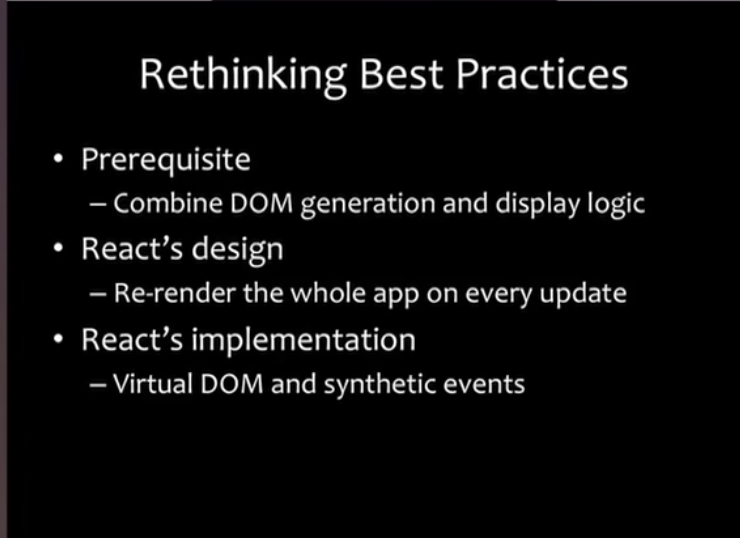
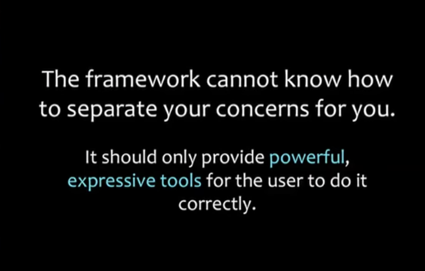
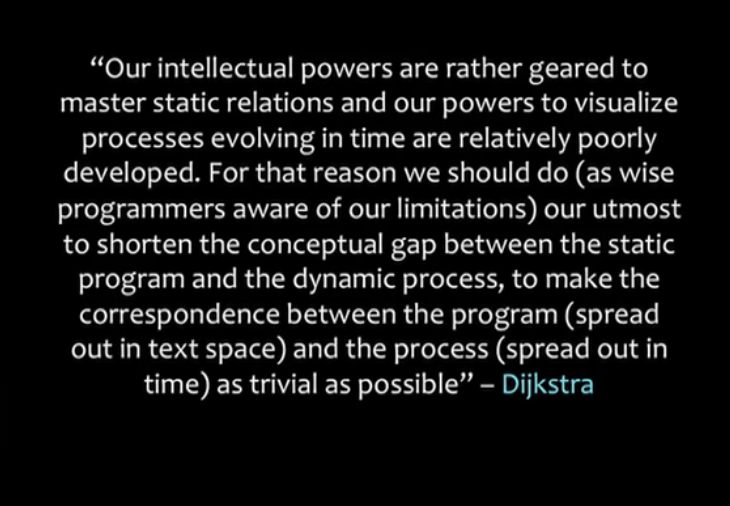
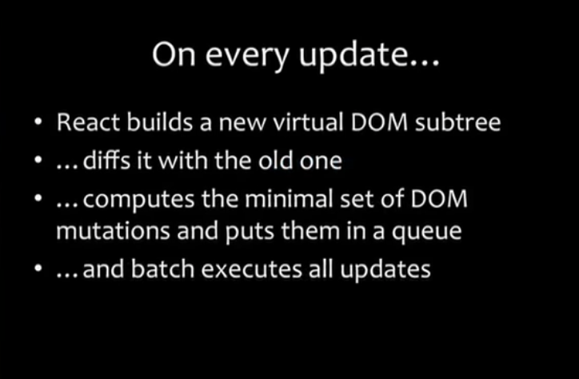

# 2013年的一段演讲：思考React最佳实践

2013 年 React 刚刚开源的时候，Pete Hunt 作为 React 团队成员，在 JSConf 中讲述关于 React 设计背后的思考。2013年至今已经7年过去，我们能从演讲中窥探一些 React 最开始的一些核心概念，对比目前版本16+，探寻改变与不变，让我们思考技术框架演进的路径。

演讲原文：[Pete Hunt: React: Rethinking best practices -- JSConf EU](https://www.youtube.com/watch?v=x7cQ3mrcKaY&t=75s)

### 演讲主题

* React 是做什么的 
* React 和其他框架有什么不同
* React 这些特性如何让开发变得更快

React - 一个创建 UI 的框架，渲染 UI 和 相应事件

### 构建组件 而不是模版

作为软件开发的金科玉律，我们都在讲关键点分析，但究竟什么是关键点分离：

* 减少耦合 Reduce Coupling
* 增加内聚 Increase Cohesion

耦合：即程序中某一模块对其他模块的依赖程度 内聚: 模块内部要素直接的归属程度

模版（AngularJS 模式）并不能很好的关注点分离：你的代码一部分在模版里（如 Angular 的 directive），另一部分在 控制器 里。而作为 `MVVM` 的 `View Model` 使得 `模版` 与 `展现逻辑`、`展现逻辑` 和 `标记` 不可避免的紧密结合在一起，所以模版并不是关注点分离的实践。

另外，在模版中我们必须不断发明新的概念（如 Vue 的 `v-for` `v-if`），但是这些概念已经在js 中存在了，为什么我们不直接使用 JS 呢。

### 框架能帮你做什么

框架不能帮助你做关注点分离，框架只能提供一个强大的工具帮你达到目的

React 要做的是不是告诉你应该使用 MVC 模式做关注点分离，而是提供一个 React Component 反应组件。React 将一个组件内部对UI的操作放到了一起，对于 React 来说，一个组件内部是高内聚的。对你而言是具有 `高内聚` 和 `对其他组件低耦合`。即 React 是 使用组件，通过JS语法，做关注点分离。

因为 React 更关注单个组件，每个组件相对独立，所以 可重用、可组合、可单元测试

#### 意大利面条代码

通过保持小组件，在组件中只关注展示逻辑，防止意大利面条代码，

"With great power comes great responsibility" - Spiderman

#### JSX

JSX 一种可选择的 HTML 预处理符号，起初设计 JSX 是为了让设计师调整样式更容易（这么说 Facebook 的设计师可以直接调整 HTML 和 CSS 代码么，666）

读取 JSX 会直接生成对应的 JS 代码

## 每次更新的时候，重新渲染整个组件

数据的每次修改都是罪恶的根源：

我们应该随着时间的推移构建抽象，使得他看起来像是对单个时间点执行的程序。90年代的网站就是这么简单，每次数据修改刷新页面就好。这就是 React 的工作方式，React 组件是一个幂等的方法，他在每一个时间点描述你的UI。

每次重新渲染使得事情变得简单，应为这保证了数据和展现的同步。但是每次重新渲染 DOM 成本非常高，所以我们需要 Virtual DOM

## 虚拟DOM

使得每次重新渲染变得更快

* 批量读、写，优化 DOM 操作性能 -&gt; 很快
* React 自动实现的顶级的事件委托
* ShouldComponentUpdate 提供一个挂载函数，告诉React 不要去区分树中某一个组件不同。即自定义更新罗觉，决定是否重新渲染
* SSR：虚拟DOM 可以在 NodeJS 中运行，去渲染一个静态页面，是的页面展示更快并更利于 SEO

## 总结

* 组件 而不是 模版
* 重新渲染 而不是 转换
* 虚拟DOM 简单 高效

