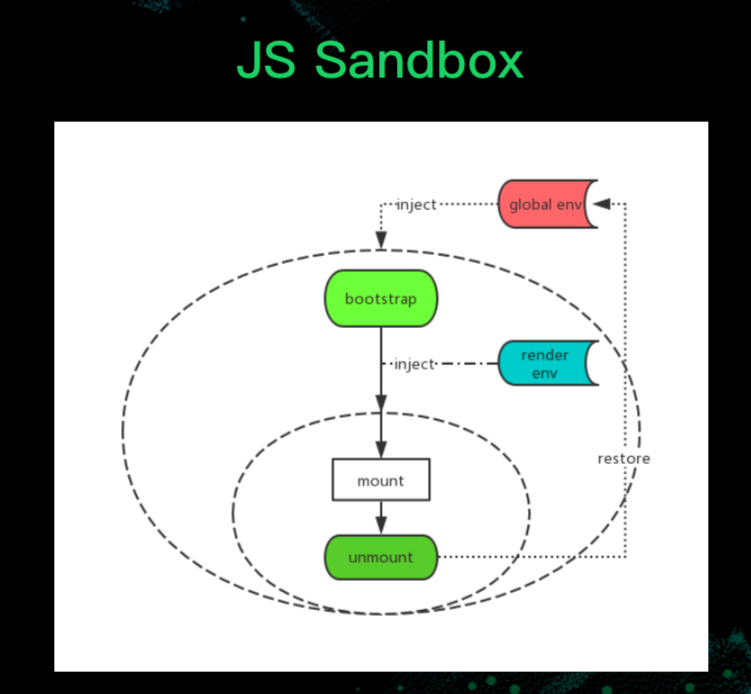
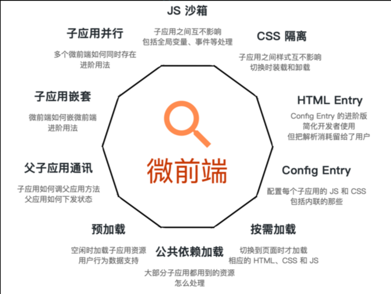
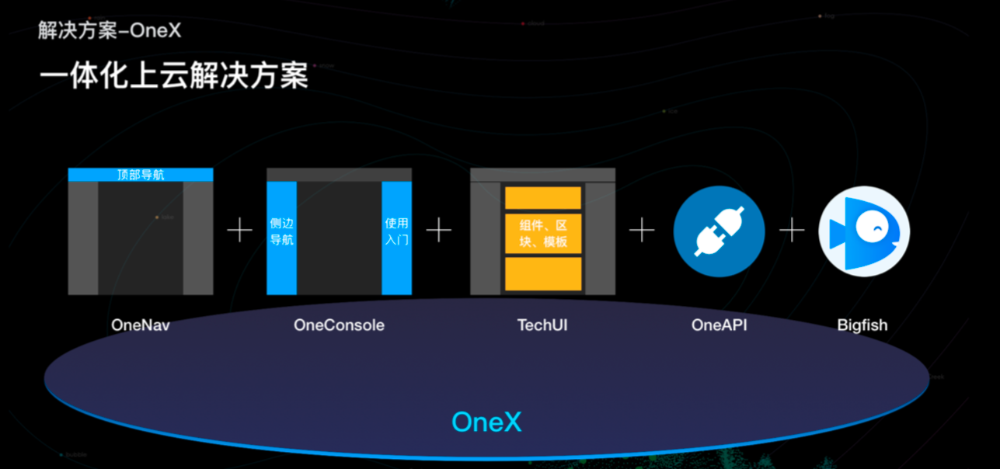
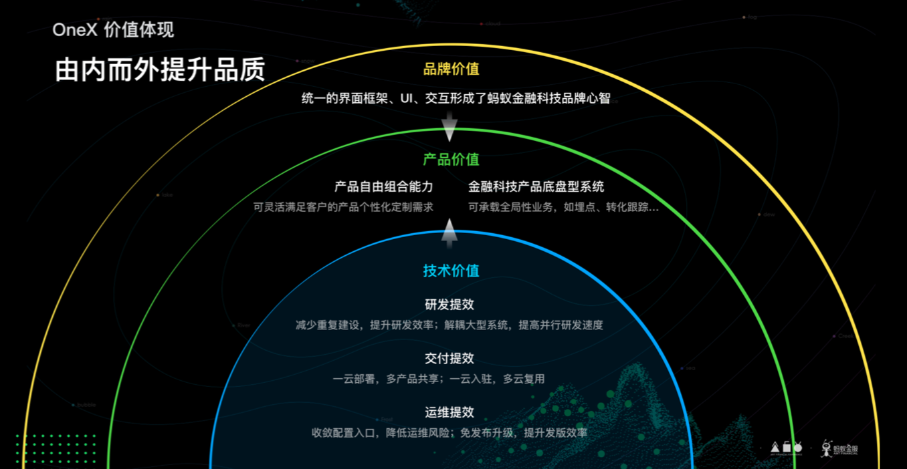
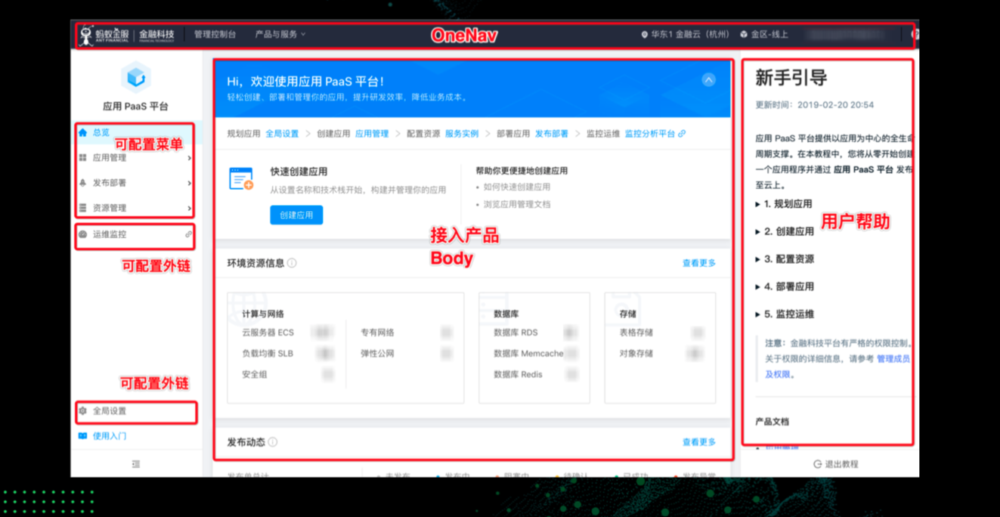

# JS 引擎级别执行过程

```js
obj = { foo() { return this } }
 
(obj.foo)() === obj // true
eval('obj.foo')() === obj // false
```

JS的两种核心执行方式

- 执行表达式  
    返回的 是引用类型
- 执行语句

前面返回得到foo函数的引用，是得到的foo函数自己，后面是


- 表达式
- 语句
- 语法（直接在展开位置插入一段语法）

# 标准微前端架构在蚂蚁的实践

### 微前端场景域

> 为什么需要微前端

1. 工程上的价值

- 技术栈老旧
- 开发人员流动
- 不兼容框架API

2. 产品上的价值

完成一个任务跳多个控制台

- 控制台视觉不统一
- 流程断点
- 重复的加载 & 认证

产品体验差

OneX 面向中后台场景的全链路解决方案

### 微前端的定义

> Techniques, strategies and recipes for building a modern web app with multiple teams using different Javascript frameworks.

思路继承自微服务

- 技术栈无关
- 发布、部署独立
- 开发独立
- 应用隔离
- 动态组合

架构类型

- MPA
- SPA

运行时

- 单实例 一个运行时只有一个 App Active
- 多实例 一个运行时有多个 App Active

### 落地决策与技术细节

- 技术无关
- 路由及应用导入
- 应用隔离
- 资源及通讯

##### 如何做到技术无关

- 基于协议开发

暴露三个钩子，具体的实现不关心

```js
export async function bootstrap() {}
export async function mounted() {}
export async function unmounted() {}
```

不与某个具体的实现耦合

##### 路由问题

##### 引用导入方式

- Config Entry
    问题：难于描述真实子应用的信息
    
    缺点：
        - 需配置完整的子应用信息
        - js/css 地址通常伴随着每次子应用发布会变化
- HTML Entry
    直接使用路径
    
    优点
        - 接入应用信息得到完整的保留
        - 接入应用地址只需要配置一次
        - 子应用原始的开发模式得到完整的保留
        
    缺点
        解析消耗留给运行时

#### 应用隔离

##### 样式隔离

- BEM x
- CSS Module
- Web Components
- 动态 加载 / 卸载 样式表

##### JS Sandbox



##### 公共资源加载

##### 实现一个全局的事件机制

```js
window.dispatchEvent(
  new CustomEvent('master:collapse-menu'),
  { detail: { collapsed: true } }
)

window.addEventListener(
  'master: collapse-menu',
  event => console.log(event.detail.collapsed)
)
```

- 兄弟节点间直接通讯以主应用作为消息总线
- 不建议自己封装 Pub/Dub 机制
- 最不推荐，直接基于某一个状态管理库做数据通讯

##### 其他性能/优化

- 异步样式导入导致闪烁问题
- 预加载



衡量微前端方案是否友好：

- 技术无关：无论子应用还是主应用都应该做到框架不感知
- 接入友好：跟接入 iframe 一样简单

### 蚂蚁微前端实践经验





### 全局埋点 / 用户转化跟踪
