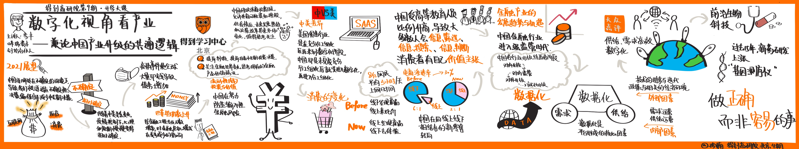

# 李丰 - 简论中国产业升级的共通逻辑

周六参加得到的开学大课，主讲人是著名的投资人 李丰，课程的主题是：数字化视角看产业，简论中国产业升级的共通逻辑。有很多新的收获和思考，在这里记录一下

### 后疫情时代

疫情对于人们来说产生了一定的心理负担，使人们被迫适应不确定性，有这种外部压力回到是人们在做决策时被迫保守，避免做长期决定。

去年疫情开始蔓延到欧美国家时，有两周，全球所有资产都在下跌，只有美元指数在涨。在面对前所未见的疫情大流行时，大家都不知道将来会发生什么，导致大家觉得黄金都不安全了。

美联储为应对疫情所释放的流动性也是空前的，这种巨大的流动性释放所会带来的问题，谁也无法遇见。所以发改委反复强调 防范输入型系统性金融风险。

### 从信息到数据

大众点评在2010年之前已经存在了五年，那么为什么大众点评在2010年开始才火起来？大众点评之前只是做到了记录信息的工具，而无法做到获取用户出行数据，随着智能机的普及及团购大战的兴起，用户开始允许互联网平台获取到他们的出行信息，当出行信息变成数据之后，结合之前已经结构化的点评数据，大众点评的最大价值和意义才被激发出来，开始成为主流平台。

PC互联网时代，在搜索引擎出现之前有大量的信息，需要各种编辑去整理，但随着信息的越来越多，效率受到人工信息整理的限制，搜索引擎通过发明一个简单的输入框，把互联网上的信息转化为可以被用户轻易检索的数据。

而我们熟悉的哪些大平台，美团、滴滴。都是通过技术的进步和普及，将信息更好的转化为数据，进而利用数据所能带来的高效规模化优势，实现平台化的。

“行业供需整体数字化水平达到一个度后，就会有质变。”

### 风没了 猪怎么办

关于P2P，之前很多已经在美国上市的P2P企业最近怎么样了？根据李丰对他们财报的分析，他们过去一年的营收最低增长2.5倍，最高的4倍。为什么？

随着国家对P2P的强监管，P2P企业关了1/3 抓了1/3，存量规模大幅降低。但这些存量里是有借贷实际需求。这些真实的需求就要找到新的出口，银行很难容纳或接待这些需求，这些需求就首先转移到了支付宝等大型互联网平台。但随着国家对蚂蚁金服的监管，这些需求又从蚂蚁出来，向下就像一个漏斗一样，来到了这些尚存的中小P2P平台，他们也迎来了一波新的增长。

### 行业监管逻辑

如果我们把视角回溯到改革开放的历史可以发现，国家每开放一个行业都遵循着这样一个周期规律：从向内开放 到 向内强监管 再到向外开放，最终彻底开放。其中向内开发到强监管的循环可能持续好几轮。

拿房地产行业举例，国家最近在反复出台政策文件强调，限制金融借贷进入房地产，可大家知道国家最早一次出台类似文件是什么时候吗？是29年前，1990年，国家为了遏制海南房地产泡沫，由朱镕基总理签发，严查、禁止金融借贷流入房地产。

这种政策的周期循环是有其内生逻辑的，所谓一抓就死，一放就乱。中国的各个行业投机行为都很重，放开后总是会乱，乱了就要管。经历几轮由乱到管的循环后，行业才能逐渐走向成熟和完全开放，而就像上面的 P2P例子一样，这种放管结合对踏实做事最终生存下来的企业来说，不一定是坏事。

### 企业服务SaaS企业在国内与美国的巨大环境不同

第一次我们说SaaS企业服务的春天在2014年，到今天，企业服务一共经历了四次春天。而在中国的企业服务，至今也没发展到美国同行的那种水平。李丰认为，这种差异来自社会分工细化到细分行业这个过程的不充分。

拿金融行业举例子，中国现在很少有人用过个人支票，中国属于是完整的跨过的以支票为主的时代。而对于信用卡，2015年中国应持卡用户为5亿，实际持信用卡用户为3亿，而常用信用卡用户仅为八千万。但对信用卡的需求是真实存在的，他们去哪里了呢？支付宝。所以中国算是半跨过了信用卡时代，直接进入了移动支付。

中国的这种飞速发展给了这种大跨度技术进步带来的支付形式变革以机会，所带来的结果就是中国没有经历美国那些对行业深度细化的过程。因为速度快所以更方面的配置设施和行业细分领域都很不成熟。由此对以解决行业细分需求为主的企业SaaS服务提供商来说，照比他们的美国同行，发展不算成熟。

### 关于零售

对于零售也是一样的逻辑，我们的零售真正起飞是在00年开始的，开启零售首先需要什么呢？商铺，就是房地产。需要首先发展房地产，随着房地产建起商铺，再在商铺的基础上，发展零售业。

我们的第一批零售企业就是苏宁和国美，这也是为什么直到2013年，苏宁才开始拓展三、四线城市。

2011-12年又一款应用叫“我查查”，用来扫描线下看到的商品的条形码，在网上对比价格。而今天，我们是在抖音上发现了一家新店，然后收藏起来准备去线下实际体验。

我们的零售刚开始发展，就遇到了电商。

十年前我们是线下发现，线上下单。十年后，我们是线上发现，线下下单。2015年，统计局发布的社会消费总额数据中首次加入电商占比。2019年电商占比为 28%，即6份线下，一份线上

这导致一个问题，如果你想要做零售，只做线下你做不大，只做线上你也做不大。而有意思的是，很多都是要么特别懂线下，要么特别懂线上。这里面有巨大的机会。

而我们的零售所面对的目标客群也在极速发生变化。2015年高等教育入学率 30%，2019年高等教育入学率 70%。这意味着，未来零售的主要客群几乎都是受过高等教育的。随着消费者教育水平的成长，他们有更多的精神和社会价值需求，有自己的价值主张，并有独立思考，进行信息检索和判断的能力。

价格可以高，但要真的有价值，能传递出价值才行。

