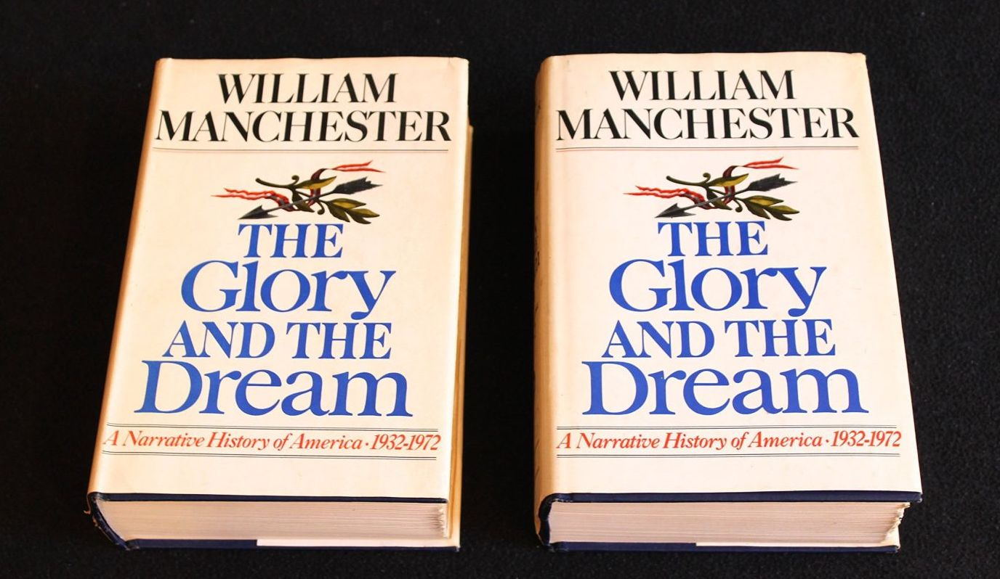

# 光荣与梦想 - 美国社会的成长与彷徨

《光荣与梦想》以断代体记史的手法，讲述上世纪 30 到 70年代（1932-1972）美国的社会、舆论、外交和政治局势。通过大小事件交替的把我们带入当时的情景之中，置换到历史人物的处境中，是了解美国的成长为世界霸权的这段历史的必读书。在我之前的印象中，美国与中国分属于不同文化，各方面都很不一样，但是看完这本书，令我惊讶的是美国的发展经历与我们有太多的相似。本书一套四册，作者试图去还原不同时期美国各个阶层的生活面貌，信息量非常丰富，这里对我印象深刻的部分做一个总结

## 30 - 40年代 成长的伤痛

### 远征军

开篇从一战刚刚结束的战后时期讲起，那些远赴欧洲参加战争的远征军老兵们为了争取补贴，组织在华盛顿进行了持续长达几个月时间的游行，老兵们将帐篷扎在宾夕法尼亚大道两侧。发展到最后，当时的总统胡佛忍无可忍，下令军队强行清理老兵聚集地，像老兵开枪。那些都是一战时为国尽忠的战士，为了自己的国家而战，打败了对手没有死在战场上，却倒在自己用生命捍卫的国家的首都，被自己的同伴驱逐。而站在政府的一方，驱逐这些老兵的新兵里，就包括未来的二战英雄、盟军总司令麦克阿瑟及他当时的下属艾森豪威尔。在首都被打散的老兵们在全国游荡，他们乘火车一个州接着一个州的游历，却没有一个州愿意接收他们。好一个飞鸟尽良弓藏！

### 大萧条

随后，残酷的大萧条席卷全国，持续十年之久，震撼了每一个美国人。从普通工人到白领、工程师、律师 大量失业，无数的中产阶级沦为贫困。美国国内的共产主义开始抬头。自由市场经济的美国因大萧条而痛苦不堪时，苏联却因其计划经济使得工业快速发展，他们占据着舆论的制高点，是人们所向往的制度：

> 失业者越来越熟悉《国际歌》的旋律。42岁的激进主义者路易斯·布登兹带领俄亥俄州的失业者联盟在哥伦布市议会大厦前游行，他们的口号是：我们必须夺取政权，建立工人和农民的共和国

### 罗斯福时期

大萧条后期，罗斯福总统上台，发表著名演讲 `我们唯一恐惧的就是恐惧本身`。推行一系列新政，强化政府对经济的控制，大规模投资基建，使得大萧条后期的经济情况得到缓解。

经历过残酷大萧条考验的美国人与我们的老一辈有很多相似之处，他们与我们现在对美国的印象完全不同，他们对婚姻关系与性 颇为保守，喜欢储蓄，提倡节俭：

> 在“大萧条”时期养成的节俭已成习惯。如果突然得到了1万美元，多数美国人都表示会购置一处房产。第二多的人会选择还清债务，把钱存入银行或投资证券。只有少数人说他们会选择轻松的生活——去旅行或者挥霍掉。

作者对突发的大事件的描写是本书好看的一个地方，就罗斯福去世这个突发事件而言，作者先是描述了国内新闻媒体对事件的报道、美国民众的感受，视角逐步推广至大洋彼岸盟军、麦克阿斯、丘吉尔，一直到戈林、希特勒。他们当时正在做什么、以怎样的方式听到这种消息、以及听到消息后的感受。给读者以极强的代入感，仿佛身处当时的事件中，观察世事的风云变幻。

> 在柏林，苏联的炮弹纷纷投落到元首的居所外面，戈培尔依旧喋喋不休地说：“我的元首！祝贺你！罗斯福已命赴黄泉！星宿显示，4月后半月我们将苦尽甘来。今天是4月13日星期五，这正是我们的转折点！”希特勒听后也颇为所动。

### 新皇加冕，称霸全球

> 有人说 "英国人在地球上仰首阔步，一副主人的样子；美国人则在地球上仰首阔步，根本不管主人是谁"

从 30年代的大萧条跌入谷底，到40年代的战争奋勇参战，50年代的消费享乐主义，再到70年代的反越战的叛逆。这一整段的历史描述的是美国怎样的从一个二线国家一步步走向全球霸权，登上国家之巅。道路充满曲折和困难，但我们从今天往回看，这一成长趋势势不可挡。当二战的炮火把欧洲夷为平地，两侧有两大洋保护的美国就注定代替欧洲，称霸全球。我们可以看到，美国成为新的霸主之后，欧洲的失落和彷徨。一方面要借助美国的力量进行战后重建，另一方面又对自己的地位被取代怅然若失，不由得回忆起之前的峥嵘岁月：

> 1945年，一把闪亮的新式美国电椅取代了法国传统派挚爱的断头台，法国人大为光火。这种变化多少具有象征意义 ... 那些被精选的葡萄酿制出的上等美酒养刁了胃口的人，居然改喝起一种廉价的棕色液体“可口可乐” —— 尽人皆知的“可乐” ... 法国人发起了反击。虽然法国还没有从空运行动中恢复过来，但巴黎的国民议会还是以366票对202票通过了一条限令：“禁止在法国、阿尔及利亚和法属殖民地进口、生产和销售可口可乐。”

### 朝鲜战争

书中对朝鲜战争时期，麦克阿瑟一份公报的记录让我不由得笑出声来。这种取名是一种来自古老东方的智慧，50年代的战忽局已经履立神功：

> 中国闪电战的第4天，麦克阿瑟发表的公报承认“我们面临的是全新的战争”，看来是想怪罪于中国的言而无信。他说，敌人的行动“已经粉碎了我们原本抱有的巨大希望，根据此前中国所宣称的，我们曾以为中国只会派一群志愿者和个别人员而已”。

## 50 - 60年代 人民对美好生活的向往

曾经美国的工人、农民阶级，随着社会的发展，财富的增长和分配的合理化，正在从无产阶级大量转为中产阶级。

> 几乎60%美国家庭报告的工资收入都达到了中级资产阶级水平。自20世纪40年代后期以来，家庭平均收入已从3083美元上升至5657美元，即使考虑到通货膨胀，也意味着上升了48%。按照阿道夫·伯利的说法，美国正处于“疾驰的资本主义”阶段。无产阶级正在转变。流水线上的工人和他们的妻子都可以开着昂贵的新汽车，还投资股票。

### 广告/消费

战后，广告业蓬勃发展，社会财富持续增长，带动消费主义盛行：

> 葛培理布道协会特意调查了地铁站里站着的乘客的习惯，以确定投放布道协会广告的最佳位置——上帝也相信市场行为研究了。
>
> 年轻人争辩说，消费不仅可以带来乐趣，也是更明智的选择，有些人认为这样也更爱国。一个广播电台录制了一首五声合唱曲，结尾是“买买买，今天需要什么就买什么”，每天都要反复播放70次。
>
> 在商品的大肆宣传中，观众们被不断地推到广告品牌的浪潮中，不断购买新商品，资金不足就向可靠的信贷公司借款，以获得那被胡乱吹嘘的美好生活，否则就有失去这珍贵的一切的危险，以及脱离群众的危险。

除了对商品的包装、宣传外，娱乐圈的明星们也开始变成工业化生产的：

> 歌星们的相似程度十分惊人，几乎一模一样——身材矮小，眼看着要发胖，这些人靠严格节食、鼻子整容手术、隐形眼镜、华丽发型来包装自己以娱乐大众。

### 汽车经济

> 20世纪30～40年代，大部分顾客搭乘公共汽车和有轨电车前来购物，因此零售商店集中在商业区很有必要。但如今到了20世纪50年代，公共交通的作用大不如前。20世纪50年代，城市中典型的购物者开始开车购物，却找不到停车位。在商业区停车几乎是不可能的 ... 顾客们却到处穿梭，找不到车位。显然，购物中心就是解决之道。设计师设计了充裕的停车设备、宽阔的沥青道路 ... 在那里，制造商直接将商品销售给顾客，就减少了支付给零售商的一笔成本费。商业大街的零售商有能力在郊区修建商店的都开了分店，其他的只能慢慢衰落，这就是社会学家所说的“中心城区的衰退”。

### 人口迁移

农村到城市，市区到郊区

> 20世纪40年代初开始的美国国内大规模人口迁移，曾在战后时期以缓慢的步调继续。在整个20世纪50年代，每年都有超过百万名农民离开农场，到20世纪60年代，总共有1700万农民离开了农场。
>
> 同时，曾经那样辉煌的城市中心被遗弃，成为穷人的居住区和富人的经营点，其他人远离了市中心。
>
> 每个工作日的早晨，几十万白领骑车或开车到曼哈顿，晚上再回家。20世纪50年代末，曼哈顿岛市政厅以南的人口白天超过100万人，而晚上只有2000人。在这10年中，超过100万纽约人离开了纽约，在战后崛起的社区生活。

## 60 - 70年代 青春期的叛逆

### 黑人暴乱

> 截至1966年年底，美国当年一共遭受了43起种族骚乱的破坏。

### 反战运动

> 1968年，从1月1日到6月15日，全美爆发了221次大规模游行示威，这些游行遍及101所大学，有将近39000名学生参与其中。建筑物被炸毁，大学校长和系主任遭到粗暴对待，墙上写满脏话，学生还用这些污言秽语辱骂警察，其中不乏来自七姐妹女子学院中的出身上流社会、教养良好的女孩的“杰作”。

这一时期，全球的青年学生好像都不太安分，以下是我从维基百科找到的关于这一年学生运动的记录：

* 日本全学联组织4.7万示威者抗议美国企业号航空母舰前往越南。
* 巴黎学生骚乱：一百万人游行穿过巴黎街头
* 南斯拉夫首都贝尔格莱德开始学生运动。
* 《人民日报》文章引述了毛泽东指示：“知识青年到农村去，接受贫下中农的再教育，很有必要。”

### 叛逆的年轻人

> 从走出经济大萧条的低谷以来，美国还从未像现在这般支离破碎。一些人汽车的保险杠贴纸上写着“要么热爱，要么离开”，另一些人的则写着“要么改变，要么失去”，这两种人之间存在着无法填补的巨大鸿沟

美国近几年随着Trump上台，我们也可以观察这两派人之间有巨大的鸿沟，在我理解这种现象实际上是人口大国的必然。从我们的历史看，从秦始皇开始，历代帝王使用各种手段将这个国家统一到一起。这种统一的成果并不牢靠，禁不住事件和事件的考验。本质上在于管理这样一个庞大的国家是一件超复杂的事情，在历史生产力水平、科技水平中，我们能维持二三百年已经算是相当不错的管理水平。地域上，物理空间上形成的阻隔可能会使得不同的人之间的意见完全不同。而中央政府要做的就是找到一种粘合剂、一种纽带保证国家的统一。这在历史上的中国和今天的中国都是不容易的。在美国也是这样，美国有跟我们差不多大的领土，以及3亿曾属于不同文化的人民，这种撕裂是必然的。

> 对于那些站在分水岭左边的觉醒的年轻理想家来说，似乎世间再没有什么是神圣的：美国国旗、上帝、母性、知识、荣誉、谦虚、忠贞，甚至简单的诚实。

## 我们

从节俭到消费；从农村到城市；从市区到郊区；从市中心的商场到郊区的工厂店；从迎合到叛逆；从保守到开放。这是美国战后随着经济发展一路的变化，对比我们有太多的相似之处。

与大萧条时期美国人的节俭相对应，在经历了文革和困苦时期的中国人就算走到现在物质丰饶的时代，节俭的习惯依然伴随终生。美国战后经济的繁盛带来的消费主义盛行，对比我们现在的买买买文化；我们的很多商场在市中心，但停车绝对是个问题。随着家庭汽车保有量的持续上升，郊区购物中心、郊区居住区会不会成为一种发展趋势？改革开放这一步步走来，重复走了很多美国在60年代所走过的道路。当然这些都是好的一面。而我真正担心的是那些随着反战运动的兴起，性解放运动、嬉皮士和毒品腐蚀了相当一部分美国人，使得他们沦为垮掉的一代。是否经济发展到这一节点势必带来叛逆？随着经济的发展，社会层次结构的固定。年轻人的上升通道越来越窄，亦是由于经济的发展，人民生活水平越来越高，这势必意味着人们吃苦精神的层层递减。而两者叠加导致社会阶层固化，年轻人没有了上升空间，这种不满情绪势必在社会中积聚。这种情况是否会在中国重演，虽然我们现在还看不到苗头，因为随之而来的技术革命使得社会凭空创造出诸多上升通道，但我们始终需谨记的是增长并不是必然的，工业革命几千年的人类文明中，我们似乎一直打转转，GDP除了在大周期中波动，平均来看是停滞不前的。技术红利有其不确定性，大概率有一天会耗尽，那时候我们的社会会是一种怎样的形态？

## 其他摘抄

* 新闻学是一门不准确的科学
* 当古巴独裁者的名字换成卡斯特罗时，他对独裁者一贯的憎恨似乎消失不见了。他对权力的满不在乎也随之消失
* 失败比成功更能考验一个人的品格
* 萧伯纳《回到玛士撒拉的时代》中的一句话：“你洞察世事，追问，‘为什么？’但是我梦想的却是之前不曾有的，我说，‘为何不呢？’”
* 社会不是什么不可思议的复杂东西，实际上它极其简单。一个人只需在一个极端与另一个极端之间，即黑与白、善与恶之间做出选择。
* 1966年波士顿市长约翰·科林斯原本处于可以连任的优势地位，但在初选的前3天，市政府的计算机自动做好准备，计算好并寄出了3万份下水道税费拖欠账单。这位市长因此落选。
* \[60年代\] 埃里希·弗罗姆警告说：“一个幽灵潜伏在我们中间……这是一个新的幽灵：一个完全机械化的社会……由计算机主导着，在这个社会进程中，人类自己也被转化成了整个机器中的一个部件。”
* 美国人有自己的方式来粉饰和崇拜他们的英雄上，他们会把英雄捧上天，然后一脚踹开

