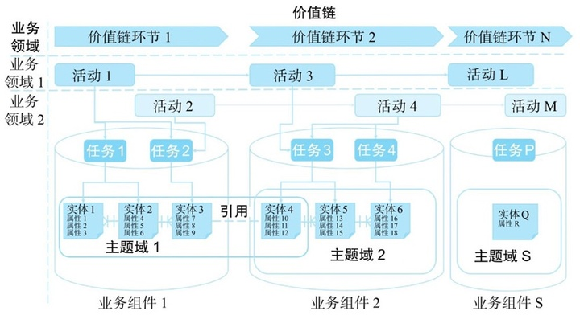
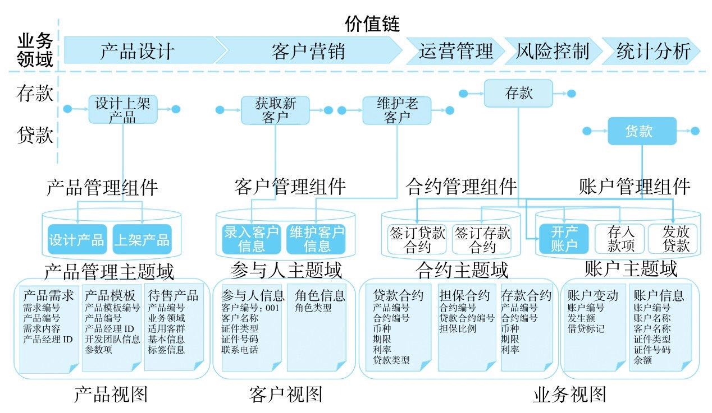
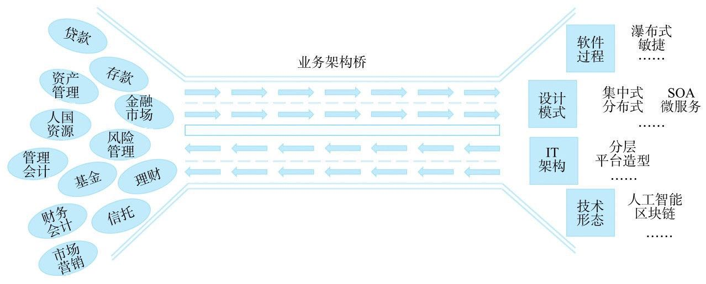

# 企业级业务架构

关于企业技术架构的研究越来越多，中台、SOA、微服务、领域驱动（DDD）、DevOps、云原生等架构模式不断创新，但这些模式大部分的精力和主要的关注点都在技术层面，很少是以业务为主，更缺乏上升到战略落地层面的思考和规划。《企业业务架构实践》中介绍了一种技术与业务深度融合的新的思考方式 —— 企业业务架构。

> 以实现企业战略为目标，构建企业整体业务能力规划并将其传导给技术实现端的结构化企业能力分析方法

业务架构是企业战略的落地而非IT战略的表达，更多的关注业务领域、业务流程、组织架构、业务数据，对这些业务实体进行标准化梳理和建模，打通战略到执行，业务到技术的桥梁。书中列举了诸多方法论，在这里做统一的梳理和思考。

## 业务架构

* 价值链：代表构建企业能力统一视图，包含多个业务流程
* 业务领域：构建企业业务能力统一视图的纵向结构，描述各类业务流程如何组件实现领域级业务目标
* 业务流程：即业务活动，由不同角色分别完成若干任务，任务执行过程中必然与业务数据发生联系
  * 活动
  * 任务
  * 角色
* 业务数据：各个业务环节产生的数据及对数据做的标准化处理 —— 数据模型
* 业务组件：将关系紧密的行为和数据关联形成业务组件，代表了企业某一类业务能力

## 标准化

企业级业务架构的关键在于对业务的各种实体进行建模，而建模的关键在于对数据和任务的标准化。

1、数据标准化：核心在于避免同义不同名，保证实体和属性的唯一 2、任务标准化：任务的标准化需要分析任务的具体业务，将数据模型与流程模型进行语义化对接，分析重复的业务动作，建模上将同一类型的实体聚焦在一个主题域下，作出关于标准化的判断。

## 业务架构设计案例：银行业务

* 企业唯一价值链结构：产品设计、客户营销、运营管理、风险控制、统计分析
* 依据价值链展开的两个垂直业务领域：贷款、存款
* 两个业务领域中三个公用的业务活动：设计上架产品、获取新客户、维护老客户
* 在2个垂直业务领域中共用的5个任务：设计产品、上架产品、录入客户信息、维护客户信息、开立账户。
* 基于数据主题域聚类任务后构成的面向各垂直业务领域开放自身能力的4个企业级业务组件：产品管理、客户管理、合约管理、账户管理。

由此可以看出，业务架构设计更多的关注的是企业整体价值的交付，涵盖企业业务的各个核心环节。根据战略对业务进行标准化的梳理和建模。他是企业业务和IT架构之间的桥梁，是二者深度融合的纽带

## 基于构件的开发模式

> 软件设计中的应对复杂问题的`永恒之道`就是`拆`，软件实现就是通过拆分的方法来降低复杂度，从而为复杂问题域找到合适的解

不只是软件领域，在诸如数学、物理学、工程等领域，对复杂问题进行拆分，分阶段解决都是一种极为有效的方法。书中提到乐高积木式的依靠可插拔组件构建软件的设计方法，即 CBD（Component-Based Development 基于构建开发）。前后端都有一种基于可复用组件开发的趋势，其核心在于降低代码量、提高开发时间、更高效的应对变化。

在业务模型中增加面向构件的表达

* 构件：将设计对象切分为零件，在通过组装零件实现新设计
* 参数
* 模版：带有参数的构件加在一起形成了一个有结构的装配模版，用于组装业务实例或产品

组件化、配置化一直是软件工程实践中绕不过去的一个部分，书中还提到另外一个概念 —— 产品目录。即以企业级视角对产品进行一个集中的梳理。从抽象的角度来看，产品即是组件的组合，而产品则可以是另一个维度的组件。这种对产品的梳理和对组件的梳理有异曲同工之妙，为业务提供的灵活性，激发生产要素的重新组合，促进业务创新。

## 双模开发

书中提供一种大企业技术团队管理的新思路：

> 双模开发：敏捷 + 稳态，可预见性的业务使用的是传统瀑布式开发，也就是稳态；探索性的业务shying的是敏捷开发，也就是敏态。
>
> 管理大企业的开发工作就像指挥大兵团作战一样，既要有担当主力、稳扎稳打的方阵部队，也要有处理特殊任务的游骑兵，多兵种之间的有序协作是克敌制胜的关键。

而对于这种轮动的开发模式，架构设计更显得尤为关键，不能为了仅仅速度而牺牲质量，从另一种角度上来说，我们在追求速度的同时，还需要有架构师纵向的去关注架构一致性。

## 文化建设才是关键

一方面，企业业务架构设计的标准化产出是IT系统，系统能力的构建是遵循一个循序渐进的过程，一个新系统的上线开始往往达不到预期的效果。很多做软件工程的书中都讲过，做项目有一项很重要的任务就是管理客户的预期，整个软件开发的过程就是不断降低客户预期的过程。但企业级还有对企业业务的助力还有另一个维度，就是对组织模式、团队氛围的改造。经过一个大规模的企业级项目建设，必然能够带给团队一种新的思考和行事方式，一种标准化、系统化的业务构建能力会在团队中逐渐养成，而这种能力恰恰是传统企业做互联网转型真正应该关注的。关键不在于一两个系统的搭建，而在于团队的文化和思考方式。正如彼得格鲁克说过的：`文化能将战略当午餐吃掉`

> 企业级业务架构设计希望实现的是整体联动、文化转型，而不仅仅是建设一套系统

## 摘抄

* 架构调整的原则：不要轻易推翻已经成为事实的判断原则，而是要通过事实建立共识，建立规则
* 架构师的宗旨是解决问题，而不是让自己成为问题
* Shortcut is the fastest way to get last - Alaska
* 创新的价值在于以新的生产方式重新配置生产要素形成新的生产力，创造新形式的劳动成果或者更大规模的生产
* "任何地方的战略价值都取决于三个基本条件：位置、力量、资源" 马汉《海军战略》
* 部门利益是做企业级的最大障碍，跨越这个障碍是对业务架构师设计能力爹最高挑战

