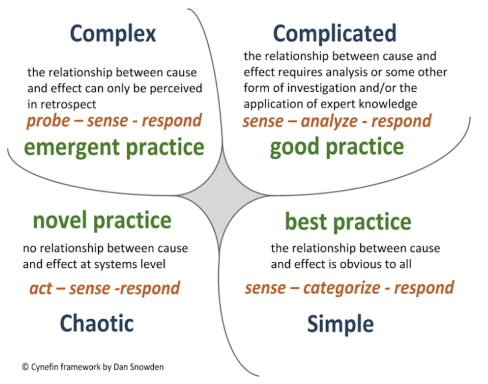
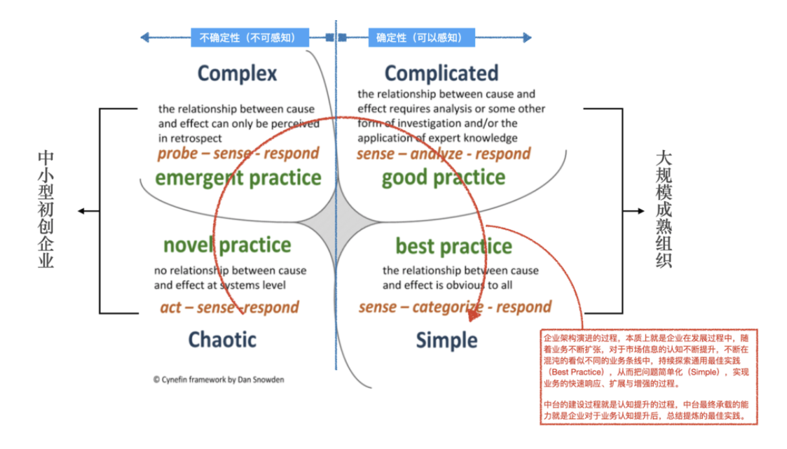

# 高效能的小技巧

## 第一性原理

出自 2300 年前古希腊哲学家亚里士多德。在亚里士多德的书中，第一性原理是这样表述的：「在每一系统的探索中，存在第一性原理，是一个最基本的命题或假设，不能被省略或删除，也不能被违反」。这里的「第一性原理」简单理解就相当于数学里面的“公理”

## 演绎法 与 归纳法

* 演绎法：从一个基本的假设出发（例如数学公理），通过一系列的等价推演，最终得出结论，如果假设为真，且推演逻辑正确，则结果一定为真。
* 归纳法：人们以一系列经验或知识为依据，寻找出其服从的基本规律或共同规律，并假设同类事物中的其他事物也服从这些规律，从而将这些规律作为预测同类事物的其他事物的基本原理的一种认知方法。

## Cynefin模型

* 简单（Simple）问题，该域中的因果关系非常明显，解决这些问题的方法是：感知-分类-响应（Sense-Categorise-Respond），有对应的最佳实践
* 复杂（Complicated）问题，该域中的因果关系需要分析，或者需要一些其他形式的调查和或专业知识的应用，解决这些问题的方法是：感知-分析-响应（Sense-Analyze-Respond），有对应的好的实践
* 繁杂（Complex）问题，该域中的因果关系仅能够从回顾中发现，解决这些问题的方法是：探索-感知-响应（Probe-Sense-Respond），我们能够感知涌现实践（emergent practice）
* 混沌（Chaotic）问题，该域中没有系统级别的因果关系，方法是：行动-感知-响应（Act-Sense-Respond），我们能够发现新颖实践（novel practice）
* 失序（Disorder）问题，该域中没有因果关系，不可感知，其中的问题也无法被解决

[源文章](https://mp.weixin.qq.com/s/YrSdzR3NevQORHqD-45z1A)

## 精通一个领域

* Chunk it up（切碎知识点）
* Deliberate Practicing（刻意练习）
* Feedback（反馈）

## 如何做一次有价值的复盘？

[原文: 如何做一次有价值的复盘](https://36kr.com/p/5309086)

### 复盘的四种价值状态

* 强化目标：便于量化和跟进进度
* 避免失误：为了同样的错误不再犯
* 复制技巧：为了传承经验和复制能力
* 发现规律：为了总结规律与固化流程

### 关于复盘的方法

* 回顾目标
* 评估结果
* 分析原因
* 总结规律

