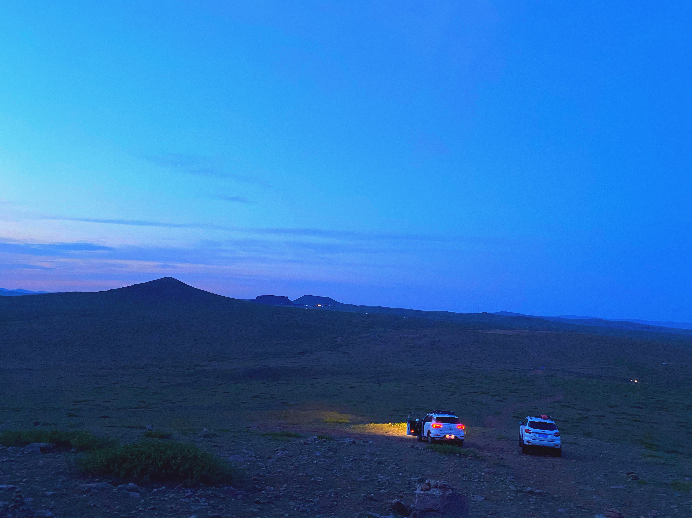

# 追太阳的人

好朋友HL说：“不管我们的选择是偏左还是靠右，是趋向激进还是偏保守，SQ，我们必须清楚认识到一点，就是我们注定是普通人。”

端午节开车从北京出发，一路向西北到察哈尔火山群。这里坐落着大大小小近十座熄灭于数千万年前的火山遗址。高耸的火山口，大量散落在草原上巨型火山岩向来往的人们诉说着这里曾经的辉煌。

“有的人擅长技术精专，有的人擅长沟通与权衡。关键不在于你懂多少。我发现，所有厉害的人，都是将自己的长处发挥到了极致”。路上同伴聊起职业发展。

"技术与业务是两个完全不同的方向，技术是确定性的事情，一段程序能跑通就是能跑通，是 0 不会是 1。而业务不一样，业务没那么绝对，有太多可以权衡的地方。业务管理本质上就是一系列决策，这些决策的质量加权加总后是业务整体的发展水平，但这也不是绝对的，还要结合市场和大环境共同作用，与技术完全是两个世界。而一定要认清一点，就是我们所做的是技术而非科学，并没有多么高深的，本质上是为业务服务的。"

“对于我感兴趣的业务，我不想在任何公司或者平台里做。任何公司内和平台都给不到我想要的自由度，一个人的能量是有限的，如果大部分的能量都在公司浪费在向上管理、流程制度还有跨部门的沟通与权衡上，那真正我们能做事情能量就比较有限了。你知道，我想的不是在现在平台里我能做什么，或者说未来我要怎么进入更大的平台。而是我创办的下一个公司，应该做些什么”

“我其实没有那么激进，我更倾向于进入一个更大的平台。我倾向于在大平台里达到一个比较高的位置。我觉得如果你不能在这达到较高的位置，自己出去干，成功概率会更低”

“就像王小波的《黄金时代》里讲过受锤的牛一样，我觉得自己还没完全被生活锤倒，还有足够的冒险和翻盘精神。我们的思路其实是不一样的，我是倾向于打破，而你则是大平台的思维。虽然充满风险与不确定性，但我愿意去一只还没受锤过的牛，一只特立独行的猪。”

“你觉得在大平台里，什么是最重要的？”

“在大平台，最重要的就是格局”。

“格局其实是相对的，相对于你的平台和你能控制的资源而言。大平台不缺资源，所以也需要更大的格局。需要对业务有深度的理解，需要对业务未来走向和公司战略有清晰明确的判断。而像我们，如果没有足够的资源，讲出大格局只会是个笑话。”

在经历了半个小时的拥堵后，我们总算上了高速，路突然顺畅了起来。决定开车速度的因素有很多，最核心的当然是限速，这是一种规则。但规则总是会被打破的。如果规则没有有效的制约，比如足够的监控探头，那速度是很难被限制在规则之内的。另外，当然也与路上的车流量又关系。我的经验里，车速总是与在车内播放的音乐节奏有一定的关系。如果音乐是摇滚、DJ、凤凰传奇，那速度肯定比放民谣和古典乐时快出许多。

越往北，内蒙的高速变得越空旷通畅。双向三车道的高速前后常常一辆车都没有。两边是望不到边际的草原。我们在中间飞驰而过，追逐着太阳，努力在天黑前到目的地。到火山脚下时太阳已经完全落了下去，但天还没有彻底黑下来。而转眼间，星空已铺就在夹杂着些许暗灰色云彩的墨兰色天空中了。每次面对星空，总会有一些感叹。

中学时地理老师告诉我们，太阳光直射位置在南北回归线附近来回摆动。太阳穿过赤道运动向北回归线，我们北半球就迎来了夏天。太阳从北回归线向南到南回归线，我们就到了冬天。可南北回归线之间只有区区几千公里的距离，竟能引起气温如此强烈的变化。看现在这漫天的星星，与任意一颗星到我们这里的距离相比，南北回归线之间都称不上一粒尘埃。

太阳直射位置，或者地日距离稍稍变那么一点，我们将灰飞烟灭。不管你承不承认，对于这个世界而言，我们就是如此的渺小，而对于我们自身而言，我们就是全部。前者是唯物，后者是唯心。在宇宙尺度上，唯物没有任何意义，不过你是多么小的尘埃，生活总还是要继续。

“你说，管理十万人是一种什么样的体验？”，路上我在看左晖的访谈录《做难而正确的事》。国家体育场能容纳八万名观众，是万人大概是坐满整个鸟巢后把剩下的人塞满水立方。

“我想，更多是要保持内心中的平静吧。之前管理的团队最多时四十人，很多事情其实做的不够好，管理十万人，不只是术的层面要做到精尖，更多的是道，是文化、价值观和哲学。还有更为关键的，是人，能聚集一批能人成就非凡事业，就像左晖说的：'我很早就意识到一件事情, 自如是熊林的事业, 不是左晖的事业'”。

“我认为我思想里是理想主义的，但被现实无情的煽了两次耳光后，我现在给自己的定义是：现实的理想主义”。

"那你什么时候再次出来创业？"

“我想这一天不会太晚了。”

天色微微向晚，天上飘着懒洋洋的云彩。下半截沉在黑暗里，上半截仍浮在阳光中。那一天我二十一岁，在我一生的黄金时代。我有好多奢望。我想爱，想吃，还想在一瞬间变成天上半明半暗的云。后来我才知道，生活就是个缓慢受锤的过程，人一天天老下去，奢望也一天天消失，最后变得像挨了锤的牛一样。可是我过二十一岁生日时没有预见到这一点。我觉得自己会永远生猛下去，什么也锤不了我。 —— 王小波《黄金时代》