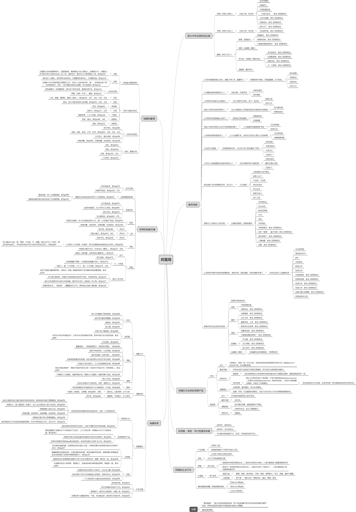
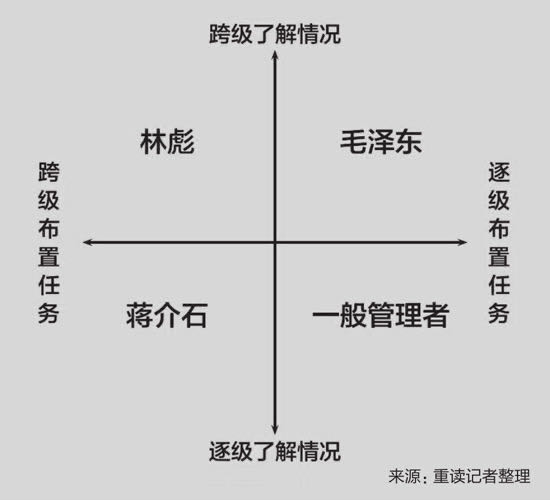

# 阿里局 书评

侠之小者，路见不平，拔刀相助；侠之大者，替天行道，为国为民

在《阿里局》中了解到阿里B2B公司即业界知名的“地推铁军”的创建和发展，当时我们也在拓展销售队伍，企图通过地推的方式销售我们的新媒体推广产品。这本书关于铁军的描写让我不寒而栗，什么是铁军：洗脑、执行力、歃血为盟、业绩PK。他对人性的潜力的挖掘到了极致。试想十年前，去卖给中小企业一套几万元，看不见摸不着，只是一个账号的产品，是个多么难事情。真的需要像马云说的那样，那些走投无路的 找不到工作的人，来到阿里巴巴，咬着牙坚持了下去，最后成就了阿里巴巴。

## 摘抄

- 政委从人推进事，业务领导从事推进人
- 注重人的感受，很容易其乐融融地完不成目标，但是整天看业务和目标，会很容易忽略了人的感受
- 将有必死之心，士无贪生之念
- 随着业务和团队的发展，日后政委的工作职责更趋复杂，每年的预算、薪酬体系设计、人员晋升、期权激励均被囊括进了工作内容。以期权激励为例，在阿里巴巴集团划定了某个部门的年度期权数后，该部门的大政委应根据组织发展、年度目标、市场节奏等要素，将这个框架落地为可执行的细则。“公司可能给你一个框架，（剩下）所有东西全部自己做，你想怎么搭（配）就怎么搭（配）。”某要求匿名的前政委表示。
- 跨级了解情况，逐级布置任务

- 毛泽东的模式最佳，既知道团队的准确情况，又体现了对管理层的信任，“毛泽东对林彪在东北打的仗再不满意，也不会直接给师长打电话。”林彪其次。林彪会越过下属遥控指挥前线，所以林彪当不了毛泽东。再次是一般管理者，安全但成不了大事。最危险的就是蒋介石。他听到的是被将军过滤后的信息，然后给将军下边的师长直接打电话。仅从管理体系的角度看，蒋介石当年也是必输无疑
- 我做你看，展示的是术；我说你听，是把这件事情背后的‘理’和‘道’说出来；然后就要看他学你这个术，他做你看；但最后希望他把术背后的‘道’说出来，所以听听他背后的‘道’有没有讲对。
- 直销可能跟渠道真的完全不一样。直销思维是自己最牛，只有我做得最好。渠道思维是别人一定比我牛，我让牛的人帮我干活，我们才最牛
- 阿里巴巴的特点是，你不能提早讲，因为当时他想法太多。有些想法讲完了，他会对这个团队这么考虑——以后电销要失业了！你得先让他把一件事做好，待事到临头，提前两三个月再跟他讲。”

#### 阿里局（二）

- 拉手偏营销，所以营销很快、很猛；美团偏产品、技术，所以产品和后台运营做得很扎实，都没有错。外部和内部现在都要很好，才能赢得越来越激烈的比赛。
- 制度设计其实不难。你只要知道要什么，你就奖励什么。很多人觉得难，是因为他不懂他要什么。”在干嘉伟看来，能判断激励体系效果的标准即是团队在成长、在进步
- 干嘉伟告诉他们，很多时候只需要关注天对中最好的和最差的者两批人
- 美团的管理层经常被干嘉伟询问团队中的“271”名单。如果管理层答得上来，干嘉伟会继续提问：“你对2和1，都做了什么针对性的辅导？”干嘉伟希望得知，“2”何时能成为接班人？还应花多少精力？“1”得到了哪些其急需的帮助？
  接下来的问题是，那个被判定为“1”的员工是否在第一时间就知道自己属于即将被淘汰的位置。“如果他自己不知道的话，这就是很大的管理漏洞。只有他知道，并且知道为什么，他才有动力和方法去改善，否则他该怎么办呢？
- 管理就是告诉下属什么是对的，什么是不对的，然后让大家去做对的，不要去做不对的。你肯定没有明确的价值导向，所以说不出谁好、谁不好。那你（在管理层中）就是那个‘1’。”
- "政委"或HRBP（人力资源经理）的本质是前线大将的合作伙伴，在很大程度上属于被运用的一个角色。那么，如何用好“政委”，在很大程度上取决于大将的水平。即使“政委”达到成熟水平，也不乏其沦落为“军长秘书”或者与“军长”互相猜忌的案例
- 因为大道相通，只有没建设过系统、只见过系统的人才会觉得一套方法论只适用于一家公司。
  建设过系统的人有更高的概率掌握管理的核心原理。
- ‘见’系统和‘建’系统的差别。
- 敢动刀子（维护价值观）才是铁军，见血才叫铁军。”吕广渝认为，“只会签单不算铁军。跑得勤，那是农夫模式，还得能总结成方法论并传承下去，这也是王刚、陈国环不一样的地方。”
- 为什么我说第二年开始美团会越跑越快？就是因为我知道我做事情跟别人是不一样的。我是围绕人的培养来做的，借假修真。我做的是更有积累的事情，而且我在广东实践过这些经验，别人可能是借假修假
- 想要加快销售的工作进展，张强觉得与其期待招聘到好员工，不如试着用流水线的思路分解销售动作以提高效率。
- 让一个人做单一的事，他会很专业，很容易就做到八九十分。这样不断把他的工作拆开，整个体系的运转就会很快
- 一个层次看问题，下一个层次做事情
- 陈国环说自己利用人仰望成功、恐惧失败这两个心理特质激励代理商，“有点人性和理论的结合，为什么渠道管理非常难，就难在这里”。
- 2001年年中，网易因财报疑点被停牌，再加上业务的长期不顺、公司的人事震荡，丁磊在愤懑、煎熬、委屈、无奈中请教步步高集团的创始人段永平出售网易的相关问题。段永平问他卖了公司之后要干什么，丁磊回道，再开一家公司。对此，《沸腾十五年》一书的记叙是，段永平笑了：“你现在不就在做一家公司吗？为什么不做好呢？”
- 无怪乎苏格拉底将“认识你自己”作为其哲学的纲领。唐万里感慨创业之难：“很多时候都是极度难。容易的事情，肯定不是创业者干的。”
- 王兴、张一鸣、杨浩涌等人对如何赚钱、客户从哪里来、成本结构如何、生意规模扩大后的成本结构如何等问题更了然于胸。而中供系创业者有时候选择行业和机会时的逻辑性不强，可能会偏向于拍脑袋做决策。
- 你知道阿里人出来找方向是非常多的，像无头苍蝇乱撞。阿里人又很主观，擅长激励，把自己激励了，再去激励团队。”
  不擅长商业判断，自然会影响对用户需求的洞察力，进而做出错误的产品改进方向。唐万里便是在回家吃饭需要改进产品的用户体验时，在要不要先做配送的抉择上，做出了错误的判断。
- 训练商业判断的最佳方式就是试错。王永森觉得在阿里巴巴干一年等于在别的公司干三年，而自己创业一年，等于在阿里干三年。“从来没碰过那些东西，融资、品牌等。团队也是从无到有搭建的。每一个问题扑面而来，没有人替你扛，你自己要去扛。”
- 卫哲曾在一次演讲中总结过阿里中供系创业者的这种毛病：“没有看到我们阿里系的同学创业，在对原来的方向进行调整的时候，有这么明确清晰的规划，或者说只看到改变的优点……很多人告诉我当初定方向时考虑了最少几个星期，换方向通常考虑一天或两个晚上，或者一个星期。”卫哲认为，这种习惯再结合中供人超强的执行力，会让公司在换方向的时候因力道太猛而导致翻车。
- 侠之小者，路见不平，拔刀相助；侠之大者，替天行道，为国为民
- 这个也是没办法。有的事情，A和B都是最好的。但问题是你在那个时候，要是A和B都做，你就做不好了，你只能做A或者做B。很多时候是鱼和熊掌的关系
- 在阿里巴巴体系，晋升前先平调，若旧地的业绩不往下掉，新地的业绩开始增长，那么该员工即获得晋升
- 张卫华认为团建有三种形式：一种是思想的团建；一种是生活的团建；一种是目标的团建
