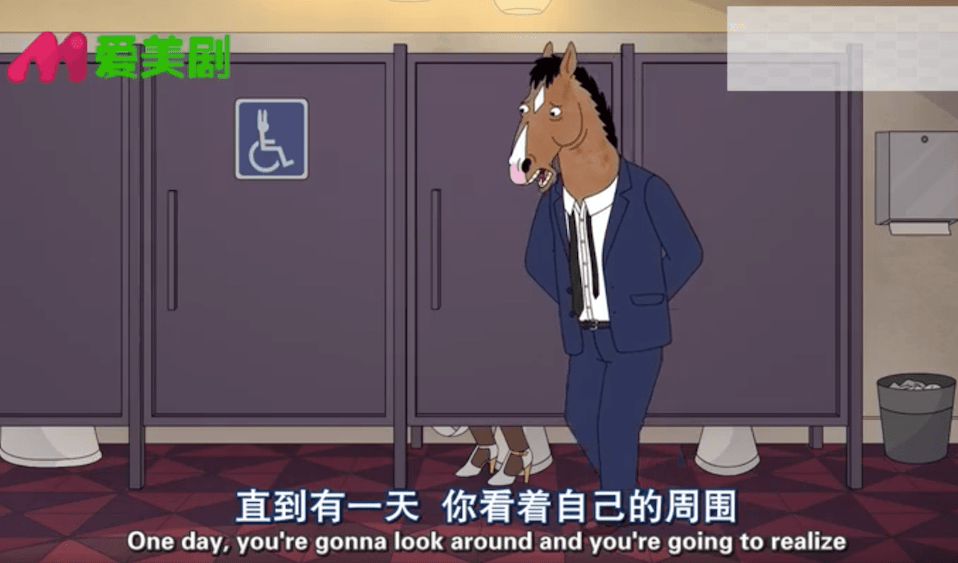

# 马男波杰克

五年前被朋友种草了《马男波杰克》这部剧，一直想看没看，前一段疫情期间有了大笔的独处空闲时间，偶然想起就找到资源一口气把五季全刷完了。是一部能让人笑的很快心的剧，也是能引发对生活思考的剧。当我们注定沦为平庸，不再那么充满希望，时间匆匆滑过，每一天都不一样，但是我们总能发现时间机器像永恒的重复着同样的事，生活平淡无奇，我们该怎么办。熟读历史能让我们更好的理解过去，而当过去变为过去，我们的学生时代、我们的青春沦为过去，我们又如何去面对未来。在写《黄金时代》的短评的时联想起来《局外人》，想起了加廖的 生活的荒诞与存在主义：

    由于人和世界的分离，世界对于人来说是荒诞的、毫无意义的，而人对荒诞的世界无能为力，因此不抱任何希望，对一切事物都无动于衷

波杰克似乎就是这样一个人，就像提到这部剧时大家都认同的那样，我们每个人都能从波杰克的身上看到自己的影子。

### 台词

