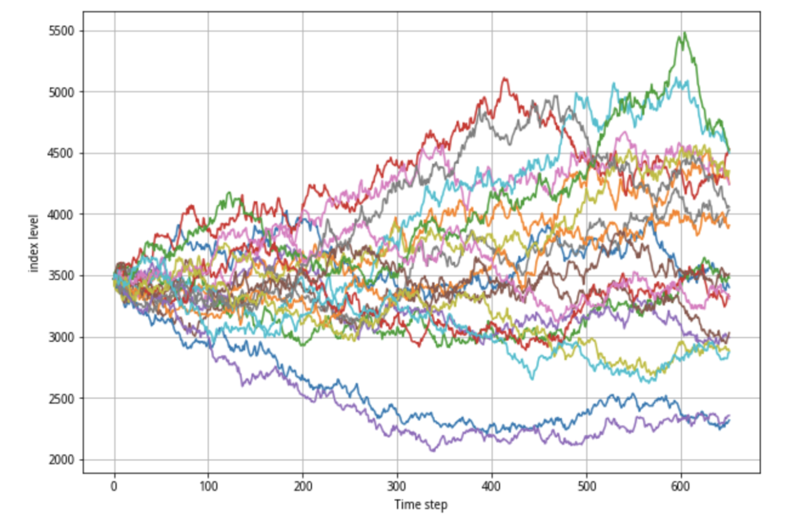

# 驾驭市场的随机性 —— 寻找确定性漩涡

### 关于随机性

塔勒布在《随机漫步的傻瓜》、《黑天鹅》 等书中反复强调了市场中的和随机，导致价格的因素过多，市场几乎是不可预测的。很多时候我们尝试对市场进行预测的行为，有的时候可能获得收益，由此我们可以理解为是找到了市场中某种模式。但更多的时候可能只是碰上是了很好的好运气，赶上了好的时候，这种可能性又高呢？

这里有一个策略很有意思，我们通过蒙特卡洛随机游走生成 2000 个随机路径：

然后寻找与目标市场历史价格的皮尔森系数最相似的一条。有一定概率我们能找到一条跟目标市场价格走势相似的随机路径，比如这条

在执行一次，找到其中最相似的一条：

可以看到从左侧上涨趋势中到右侧震荡市，很多波段都会有雷同。第一次看到这个结果我是挺震惊的，如果这条橘黄色的线是某个量化交易策略回测的结果，或者某种资产价格。我们主观上可以认为他跟目标市场是存在极高的关联度的，可他只是随机游走。这始终提醒着我在面对市场的时候保留一些对随机性的敬畏和警惕。但是否意味着，尝试通过价格这种极其复杂的因素预测市场是徒劳的呢，下面有两个混沌系统研究专家提供了一丝希望。

### 确定性的漩涡

在《对冲之王》第六章【从精灵公司到预测公司】中，讲述了两个混沌理论大师海默（J. Doyne Farmer）和帕卡德（Norman Packard）的故事。他们通过将混沌理论运用到金融市场中，发现使用一定的黑盒模型可以在很短的时间内或在一些特殊情况中，以极高的概率预测市场。他们把金融市场看作一个混沌系统，混沌系统在长期看来预测是极其困难的，就像他们提出的蝴蝶效应那样，初始的极小误差会在相当长的一段时间后演变为完全不同的结果。但这些物理学家们还是通过预测市场获得了超额的收益，这就让我觉得有必要研究一下他们究竟是怎么做的。

关于他们的故事在很多关于不确定性的书中都有踪迹，我找到另一本 [失控](http://www.bidutuijian.com/books/shikong/155.html) 中提到的了几个值得仔细研究的内容：

- `有正面意义的短视`：指不管是人类厉害的围棋棋手还是深思程序，都不需要看得太远，只要挑选出未来一两步的走法并对未来短期内对局势做一个判断即可。
- 预测模式看起来没有先知的样子也可以，它只需要从随机和复杂的伪装背后发现有限的模式 —— 几乎什么样的模式都可以。
- 两种不同的复杂性 —— 内在的 和 表面的，内在的复杂性由于其自身高度复杂是不可预测的那个部分，是混沌系统 `真正的` 复杂性。而外在的复杂性是混沌系统的另一面，`掩盖着可利用秩序的复杂性`。有一定的模式和规律可循，找到对应模式可以对其进行预测。
- 混沌系统的另一面 (表面的复杂性) 足够稳定，足以依赖
- 复杂系统中某些区域是可以预测的 —— 可预测范围或局部可预测性，`不可预测性在整个系统中分布不是统一的`
- 看着市场中的混沌，就好像看着波涛汹涌、浪花四溅的河流，他充满了狂野的、翻滚着的波涛，还有那些不可预测的、不断盘旋着的漩涡。但是，突然之间，在河流的某个部分，你认出一道熟悉的涡流，在之后五至十秒内，就知道了河流这个部分中的水流方向。
- 但是你没办法预测水流在下游半英里处的流向，但是就有那么五秒钟，或者在华尔街那边，五个小时的时间里，你却可以预测这个演示的进展
- 人类的交易者会在无意识中学会如何在随机数据的海洋里识别出那些属于局部可预测性的模式。这些交易者之所以能够挣到数以百万计的美元，是因为为他们为了做出预测，先发掘出了模式（虽然他们说不清道不明），然后建成内部模式（虽然他们并未意识到）。他们对自己的模型或理论的了解并不比他们对自己如何抓住飞球的了解更多。他们就这么做了而已
- 预测机制其实是生产理论的机制，是产生抽象和概括性的设备
- 使计算机感染上某种粗略形态的直觉
- “概括模式搜寻能力” ——> “直觉”

### 关于临界点的研究

先直接上论文：[Dragon-Kings, Black Swans and the Prediction of Crises Didier Sornette](https://arxiv.org/pdf/0907.4290.pdf)

作者之前是在NASA工作，在一次对火箭冷却装置爆炸原因的调查中，发现了爆炸发生的阈值是有迹可循的。之后作者发现金融市场等其他复杂系统中，内部的压力到发生爆炸（金融危机）也是遵循这这种模式的。作者认为，泡沫和危机产生的原因需要从系统本身的不稳定中去寻找，并且，大部分的不确定性事件是可以被预测的。
详细的方法参见作者在TED的演讲：[How we can predict the next financial crisis](https://www.ted.com/talks/didier_sornette_how_we_can_predict_the_next_financial_crisis/transcript)

### 预测公司实践

- 预测公司利用一种混合了旧与新、低端与高端的 `搜索技术` 来对这个庞杂的信号堆进行扫描。即搜寻那些从数学上来讲属于高维空间的金融数据，也寻找局部区域 —— 不管什么样的局部区域，只要他能够和可预测的低维模式相匹配就好 —— 在金融的宇宙寻找秩序的迹象 —— 任何秩序
- 做实时或超实时工作（预测公司这种模拟金融模式币在华尔街实际运行要快）。
- 在计算机里重新制定股票市场的一个简化部分
- 当侦测到正在展开的 `局部秩序` 的波动时，就会以比真实生活更快的速度进行模拟
- 然后把筹码下在他们想见的这一波动可能结束的点位
- 归纳式的模型中，事件并不需要抽象的原因，就跟具有意念之中的棒球飞行路线的外野手，或者一只追逐抛出的棍子的狗一样不需要抽象的原因
- 学会识别应关注的模式和那些模式掩盖了秩序。而不是因果之间模糊不清的关系
- 使用诊断统计学方法测试模型
- 非线性动力学去捕捉混沌中的模式，然后用这些模式进行预测
- 托勒密式归纳法建立起来
- 问题越复杂，用到的模型就越简单。跟数据严丝合缝其实并不难，但如果你真的去做了，那你最后一定只是侥幸成功。概括是关键
- 如果有足够大的数据流，设备就能从中分辨出星星点点的模式。慢慢地，这种技术就会在内部形成专门特定的模式，以解决如何产生数据的问题。这种机械不会针对个别数据对模式做“过度调校”，它倾向于有几分不精确的概括性的模煳拟合。一旦它获得了某种概括性的拟合，或者说，某种理论，它就能够做出预测

关于模式归纳、搜索，没有什么比现在的深度学习模型效率更高的了，我们可以将所有我们能得到的信息输入的深度学习中，模型自动的从数据中寻找混沌系统的那转瞬即逝的确定性漩涡，敏感的模型足够追踪到最细微的变化，找到套利机会。这也是我另外一个研究项目 [How people use AI in finance](https://github.com/georgezouq/awosome-ai-bot-in-social-media) 的起源。

最后，套用我喜欢的《失控》原文的一句话：

> 最后的一步，也就是在它手里塞上大捆的真钱来实际运行这个程序，还需要这几位博士中的一位在键盘上敲一下“回车”键。这个动作就会把选定的算法投入到那个高速运转、钱多得能让脑子停转的顶级赛事的世界。割断了理论的缰绳，自动运行起来，这个充实起来的算法就只听到它的创造者们喃喃低语：“下单啊，呆瓜，下单啊！”
